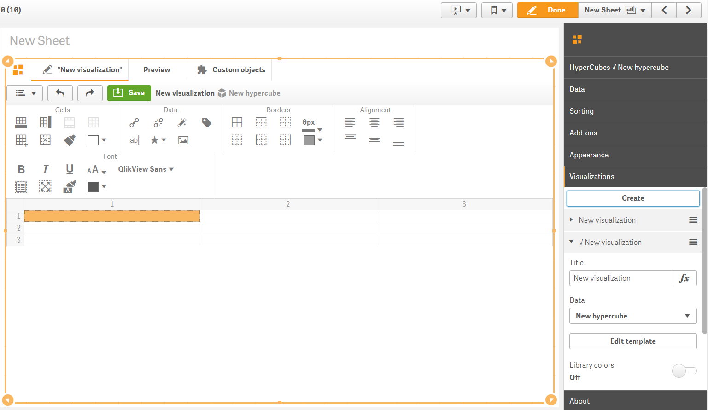
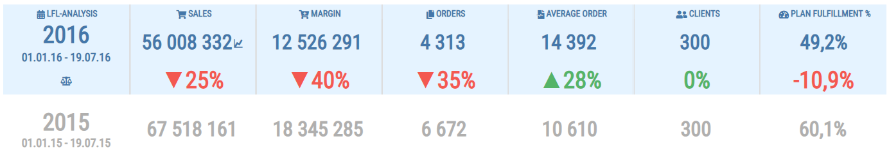
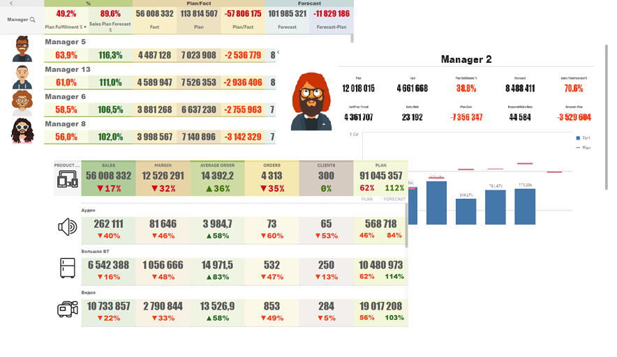

# PowerKPI for Qlik Sense

**PowerKPI for Qlik Sense** allows you to visually design responsive and interactive user experience for Qlik Sense: from simple KPI dashboards to interactive detailed list-like or table-like views.



We provide a visualization extension which allows you to build flexible and stunning-looking interactive and responsive dashboards using **spreadsheet-like visual editor**. 

It allows developers to design data views visually in accordance with business requirements and corporate styles, by applying styles using fonts, backgrounds, images, borders, alignments, colors, icons, etc. 



There is also a predefined set of actions based on Qlik stable API.




See "Features overview" for more details.





See "Demo Apps".




