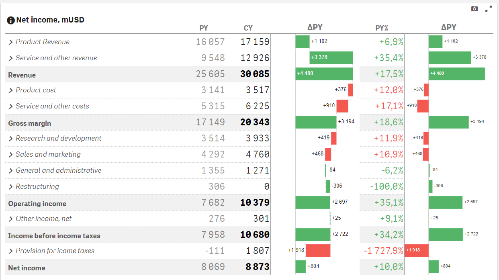

# PowerKPI for Qlik Sense

**PowerKPI for Qlik Sense** by **RBC GROUP** (see product page [powerkpi.rbcgrp.com](https://powerkpi.rbcgrp.com) for more details) allows you to visually design responsive and interactive user experience for Qlik Sense: from simple KPI dashboards to interactive detailed list-like, table-like or card-like views.



We provide a visualization extension which allows you to build flexible and stunning-looking interactive and responsive dashboards using **spreadsheet-like visual editor**.&#x20;

<figure><figcaption>
Visual Editor
</figcaption></figure>

It allows developers to design data views visually in accordance with business requirements and corporate styles, by applying styles using fonts, backgrounds, images, borders, alignments, colors, icons, etc.&#x20;


[visual-editor](visual-editor/)


There is also a predefined set of actions based on Qlik stable API.


[actions](actions/)



See "[Features overview](features-overview.md)" for more details.



See also "[Demo Apps](demo-apps.md)".

