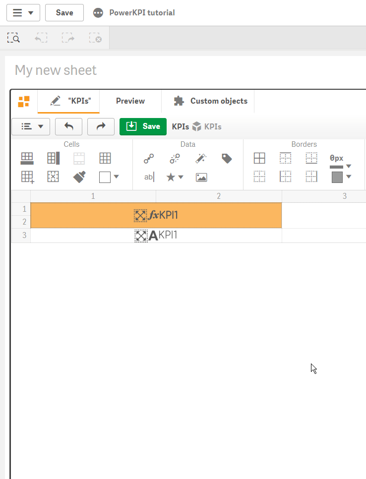

# Actions


There is a **predefined set of actions** based on Qlik stable API:

* “**Set variable**” action allows you not only to create and set variables with custom values or using expressions, but also set variable based on a “current” dataset row dimensions and measure values



* “**Activate view**” action allows you to interactively visualize one from predefined sets of visualization templates. Users can manually activate views in accordance with user interactions \(clicking and tapping\) or conditionally - using expression;
* “**Go to sheet**”, “**Next sheet**”, “**Previous sheet**”, “**Go to story**”, “**Go to url**” allows business users in just one click to open appropriate business data context – sheet, story or even another application;
* “**Select values**”, “**Select all**”, “**Select match**”, “**Select alternative**”, “**Select possible**”, “**Select excluded**”, “**Toggle select**”, “**Clear**”, “**Clear all**”, “**Clear other**”, “**Lock**”, “**Lock all**”, “**Unlock**”, “**Unlock all**”, “**Create bookmark**”, “**Apply bookmark**”, “**Remove bookmark**” set of actions which will allow you to extend standard based selections model with custom selections scenarios during user interaction with data visualizations;
* “**Reload**”, “**Partial reload**” actions allow you to load data on demand;
* “**Export data**” action allows you to export data not only from current data view but also from any predefined master visualization items;
* “**Value color**” and “**Mini chart**” actions allow you to represent numbers in one of graphically predefined ways;
* “**Zoom in**” and “**Zoom out**” actions allow you to expand visualization in full screen mode and close it;
* “**Sort**” action allows you to apply or remove interactive sorting capability for each column separately \(in case of table representations\);
* “**Alternative dimensions/measures**” action allows you to apply or remove interactive dimensions and measures buttons separately for each data column labels;
* “**Searchable dimension**” action allows you to apply or remove search functionality for each individual dimension column

You can apply the set of actions to any cell or cells to make the visualization more interactive and functional.

Click toolbar  button to **open actions panel** and **apply actions** on selected cell.

To add an action click button on "Actions" panel. You may apply on any cell as many actions as you want.


Some actions applicable on a cell with bonded dimension, some - with a measure, and there are actions which can be applied on any cell.


Cells with applied actions will have special icon in top left corner when “Actions” panel will be shown.

