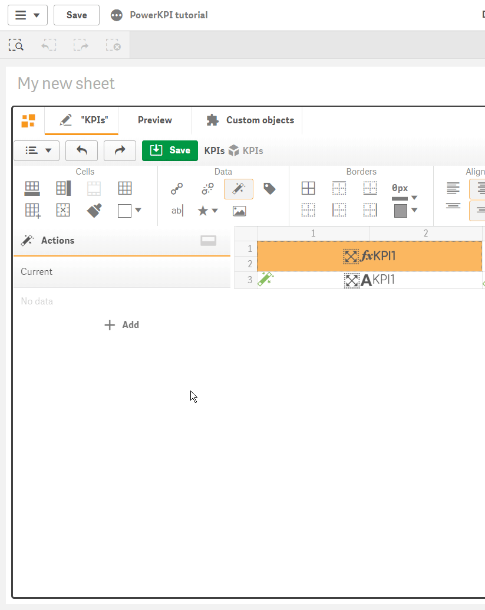

# Activate View

The action will activate the specified visualization.

Click the special button to select a visualization.


See "**Visualizations**" section of the documentation for more details about creating visualizations.




