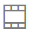
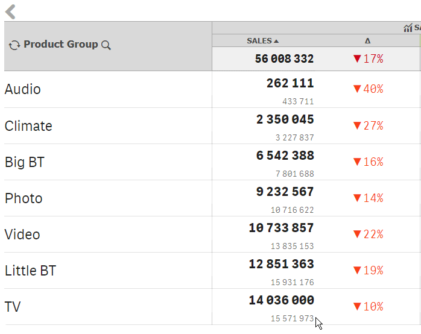

# Alternative dimensions/measures

It will allow users to interactively select an alternative dimension or a measure using  special button displayed along with the label.


The action can be applied on a cell with a dimension or a measure label only. The action is applied automatically when the dimension or measure label is dragged onto a cell. The visualization should have at least one alternative dimension or a measure


There are no parameters available.

