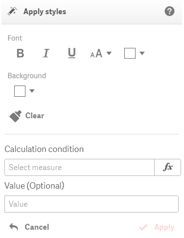

# Apply styles

The action will conditionally apply style formatting options on a cell. Currently, font styling options like bold, italic, underline, size, color and background color are supported. Those styles will be only applied if the calculation condition measure returns true. As an alternative option, if you specify a measure in the calculation condition parameter that returns non-boolean values you can also specify any value in the "Value" parameter. In such a case, specific styles will be applied only if the "Value" equal to calculated condition value. The "Value" parameter is optional.

