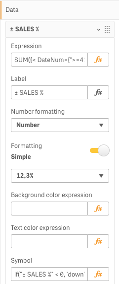

# Apply symbol

The action will conditionally apply a symbol (icon) for a cell with a measure and the one of the predefined algorithms: “Positive/Negative” or “Less than 100%”.

### Positive/Negative

"Positive/Negative" algorithm can be used to show icons for postive, negative and zero values by setting appropriate icons.

### Less than 100%

"Less than 100%" algorithm can be used to show icons for values less than 100% and for values greater or equal to 100% by setting appropriate icons.

.png>)

### Expression

The "Expression" option  allows to map the "Symbol" expression's values to particular icons. To be able to use such option a "Symbol" expression should be set for a measure using the properties panel:

After binding the measure with a cell (in our case the "± SALES %" measure) it is possible to map the "Symbol" expression's values to particular icons:

You can add as many mapping items as needed by clicking the button next to the "Edit mappings" label. For each added row you need to specify a value (by entering it in the input text field) and an icon (by selecting it from the icon popup menu).
