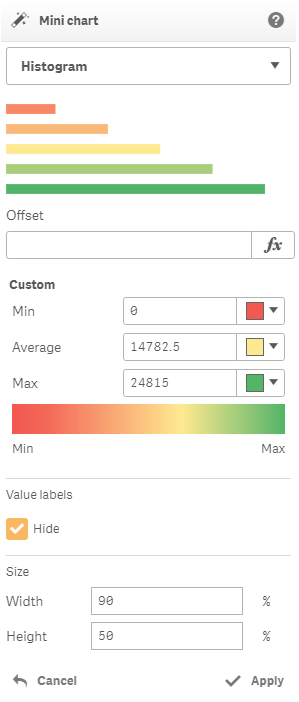
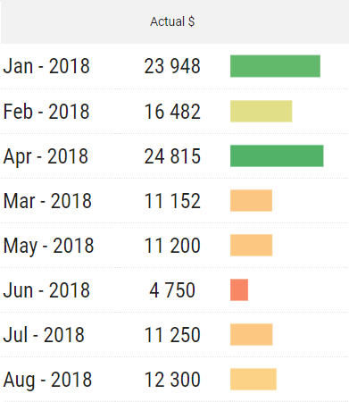
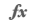
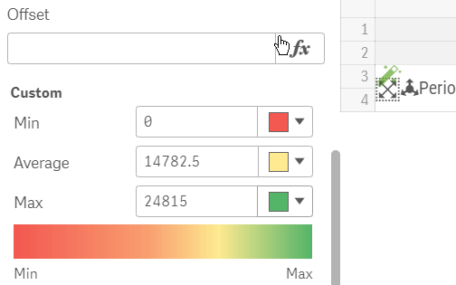
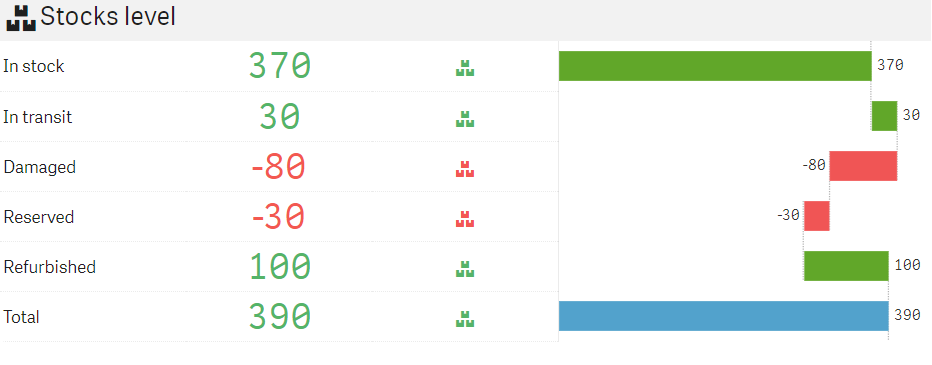
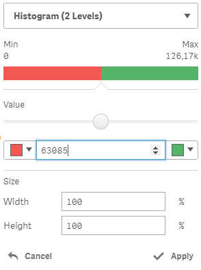
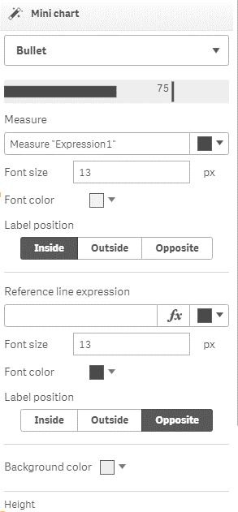

# Mini chart

The action will show a minichart based on a measure value.


This action can be applied on a cell with a measure


There are following minichart options available:

* Histogram
* Histrogram \(2 Levels\)
* Bullet

### Histogram

Histogram is the graphical way of representing KPIs.

It is possible to set the minimum, average and maximum values and set the corresponding colors. By default, those parameters are initialized based on the corresponding measure values.

The "**Offset**" parameter optional and can be used to apply offset on a bar based on the selected measure. To open list of available measures and be able to select a measure, click  button.

The "**Offset**" parameter can be used to build **WaterFall** charts.

**To create WaterFall** chart you should add a measure wich will define the offset for each dimension's value. In our example we have used a dimension with the following values: "In stock", "In transit", "Damaged", etc. Stocks level is determined by the measure "StocksLevel" which was defined as: `SUM(StockLevel)`. The Offset measure called "BarOffset" can be defined in the following way: `rangesum(above("StocksLevel"), above("BarOffset"))`. So, Minichart action is applied on the "StocksLevel" measure with selected "BarOffset" measure as the "Offset" parameter. 

See Demo Apps page for more details.




It is also possible to change the size of the minichart using the “**Width**” and “**Height**” options. The width and height is set in percentage of the occupied area.

There is the "**Hide**" parameter under the "Value labels" header.  It allows to hide value labels.

### Histogram \(2 Levels\)

It allows showing a histogram with two color levels only.

A Boundary value is set to the average of the corresponding measure by default and can be changed.

It is also possible to change the size of the minichart using the “Width” and “Height” options.

### Bullet

It allows showing the bullet chart, based on a measure value. The additional measure can be used to draw the reference line.

The "Measure" parameter is bonded to the measure of the current cell and, thus, it can't be changed here.

It is possible to change color, font size, font color and label position for the "Measure" parameter.

The "Reference line expression" is not mandatory but can be used to show the reference line using the specified measure. It is also possible to set the appropriate color for the reference line, and additionally - font size, color and label position.

Background color can be also changed.

