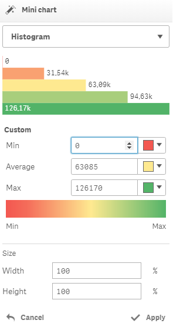

# Mini chart

Shows a minichart based on a measure value.


This action can be applied on a cell with a measure


There are following minichart options available:

* Histogram
* Histrogram \(2 Levels\)
* Bullet

### Histogram

It is possible to set the minimum, average and maximum values and set corresponding colors. By default, those parameters are initialized based on corresponding measure values.


It is also possible to change the size of the minichart using the “Width” and “Height” options.

### Histogram \(2 Levels\)

It allows to show a histogram with two color levels only.

A Boundary value is set to the average of corresponding measure by default and can be changed.

It is also possible to change the size of the minichart using the “Width” and “Height” options.

### Bullet

It allows to show the bullet chart, based on a measure value. The additional measure can be used to draw the reference line.

The "Measure" parameter bonded to the measure of the current cell and, thus, it can't be changed here.

It is possible to change color, font size, font color and label position for the "Measure" parameter.

The "Reference line expression" is not mandatory but can be used to show the reference line using the specified measure. It is also possible to set appropriate color for the reference line, and additionally - font size, color and label position.

Background color can be also changed.

