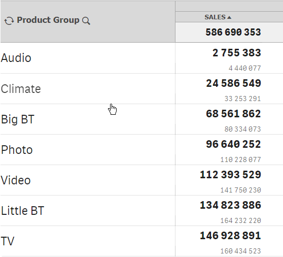

# Searchable dimension

The action will allow users to interactively search and make selections of the data in the specified dimension using   special button displayed along with the dimension label.


The action can be applied on a cell with a dimension label only. The action is applied automatically when the dimension label is dragged onto a cell


There are no parameters available.

