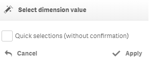
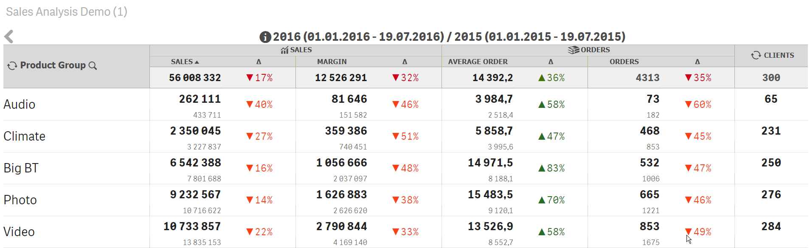

# Select dimension value

The action will allow to make selections of dimension values \(with or without confirmations\).


The action can be applied on a cell with a dimension only. The action is applied automatically when the dimension is dragged onto a cell


The "Quick selections \(without confirmation\)" option will allow to make selections without the confirmation \(the confirmation panel will not be shown\).

If the "Quick selections" parameter is not set the confirmation selection panel will be shown.

