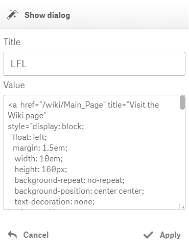
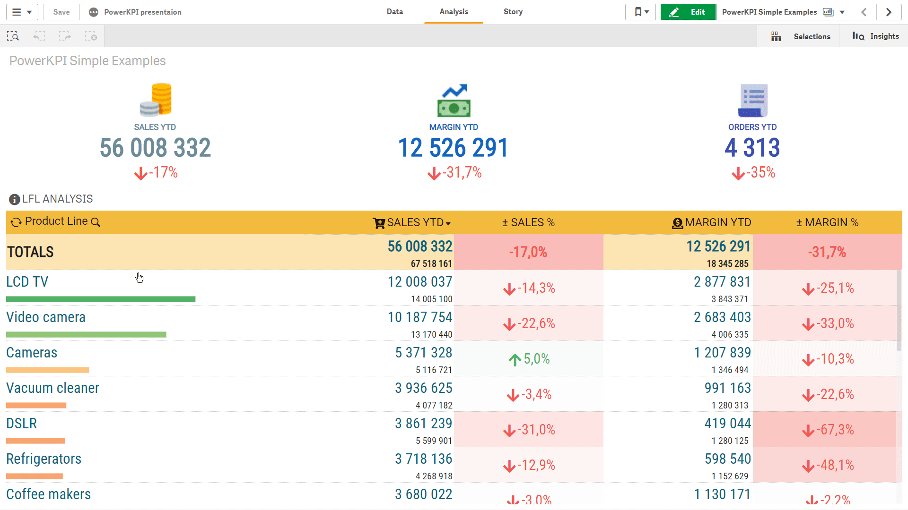

# Show dialog

It opens a popup dialog when a user clicks or taps on a particular cell on which the action was applied.



The "**Title**" parameter can be used to define a dialog title. Title can be formatted using HTML.

A Qlik expression can be used in the “Title” parameter by prefixing it with an equals sign, e.g.:

```text
=if(GetPossibleCount(Year) > 1, '<h1>YTD Sales Analysis<h1>', '<h1>Sales Analysis</h1>')
```

The "**Value**" parameter defines the body of a dialog. HTML can be used to format a dialog content.

A Qlik expression can be used in the “Value” parameter by prefixing it with an equals sign and a text content should be enclosed with single quotes.


There is a **special macro** wich can be used **to embedd a master visualization** in a dialog:

```text
$object_id{<css styles>}
```

 **object\_id** - is an Object ID. You can get it using the "Embed chart" context menu or hidden "Developer" menu. As an alternative option, you can use "Single configurator" tool from Qlik Sense Dev Hub. See [Single configurator](https://help.qlik.com/en-US/sense-developer/Subsystems/Dev-Hub/Content/Sense_Dev-Hub/SingleConfigurator/dev-hub-single-configurator.htm) help for more details.


See video below how to use hidden menu for developers.


&lt;**css styles**&gt; - optional. It can contain valid Cascading Style Sheets \(**CSS**\) definitions. See [Mozilla Developer Network](https://developer.mozilla.org/docs/Web/CSS) for more details on this topic. 

For example, to embed a master visualization with appropriate Object ID \(e.g., ed67d66d-022a-4755-9f2d-49cf2fda2abf\)  and set the width and height of the object the following macro can be used in the "Value" parameter:

```text
$ed67d66d-022a-4755-9f2d-49cf2fda2abf{display: inline-block;width: 100%; height: 250px}
```

In such a way, **unlimited number of master visualizations can be embedded in a dialog**. 





Video: Qlik Sense February 2018 - hidden menu for developer





