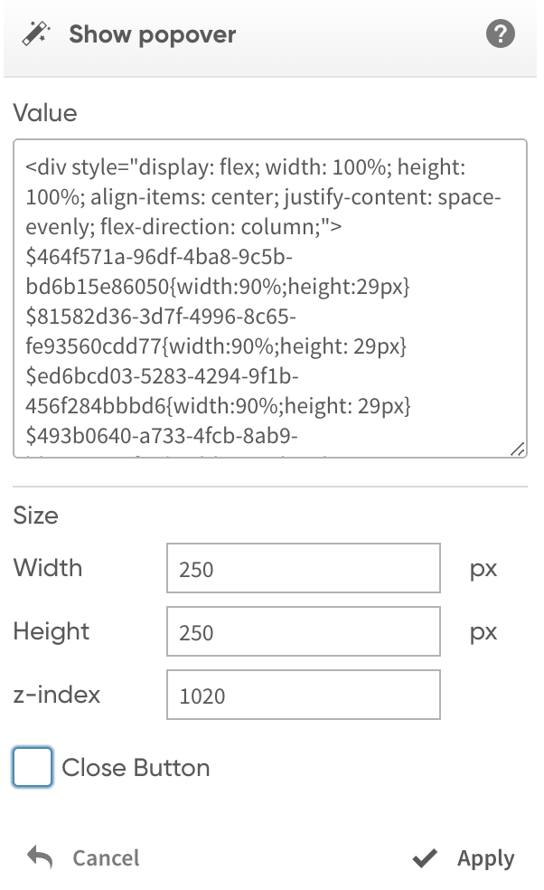

# Show popover

The action allows the developer to show a popup window with a given width and height. It supports HTML as well as embedding master visualizations.

<figure><figcaption></figcaption></figure>

<figure><figcaption></figcaption></figure>

The "**Value**" parameter defines the body of a popup window. HTML can be used to format the content.

A Qlik expression can be used in the “Value” parameter by prefixing it with an equals sign and a text content should be enclosed with single quotes.

It is possible to **embedd a master visualization** using the following syntax:

```
$object_id{css styles}
```

_**object\_id**_ - identifier of the master visualization object.&#x20;

_**css styles**_ - the CSS styles to apply to the embedded object.

Example:

```
$9bc03224-f072-439f-b0de-3014860d4f8a{width:100%;height: 40px}
```

The "**Width**" and "**Height**" parameters allow the developer to set the size of the popup in pixels.

The "**z-index**" CSS property sets the z-order of a popover. Overlapping elements with a larger z-index cover those with a smaller one.

The "**Close Button**" checkbox determines how the popover is closed. If the "Close Button" check box is set, the pop-up window can be closed by clicking the close icon. Otherwise, the popup window can be closed by clicking on any object on the sheet outside the popup window.

<figure><figcaption><p>Popover with the Close Button</p></figcaption></figure>
