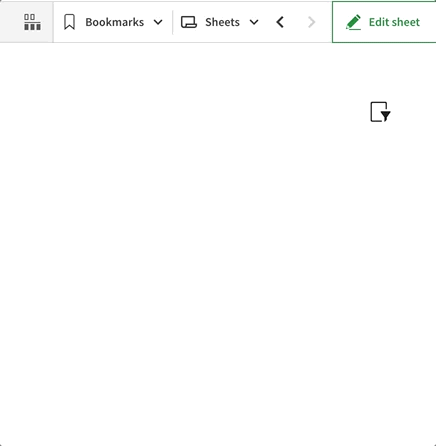
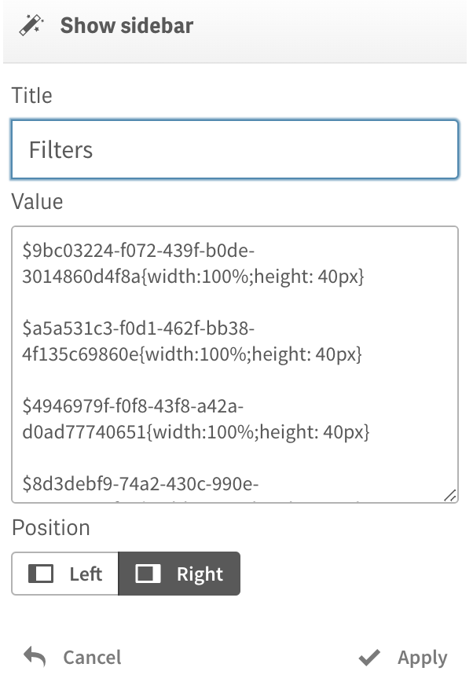

# Show sidebar

The action shows a sidebar panel on the left or right side of a sheet.

<figure><figcaption></figcaption></figure>

<figure><figcaption><p>Parameters</p></figcaption></figure>

The "**Title**" parameter can be used to define a title. It can be formatted using HTML.

A Qlik expression can be used in the “Title” parameter by prefixing it with an equals sign, e.g.:

```
=if(GetPossibleCount(Year) > 1, '<h1>YTD Sales Analysis<h1>', '<h1>Sales Analysis</h1>')
```

The "**Value**" parameter defines the body of a sidebar. HTML can be used to format the content.

A Qlik expression can be used in the “Value” parameter by prefixing it with an equals sign and a text content should be enclosed with single quotes.

It is possible to **embedd a master visualization** using the following syntax:

```
$object_id{css styles}
```

**object\_id** - identifier of the master visualization object.&#x20;

**css styles** - the CSS styles to apply to the embedded object.

Example:

```
$9bc03224-f072-439f-b0de-3014860d4f8a{width:100%;height: 40px}
```

The "**Position**" parameter determines the side of the sheet on which the sidebar is displayed.
