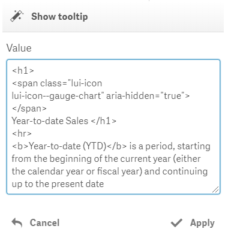
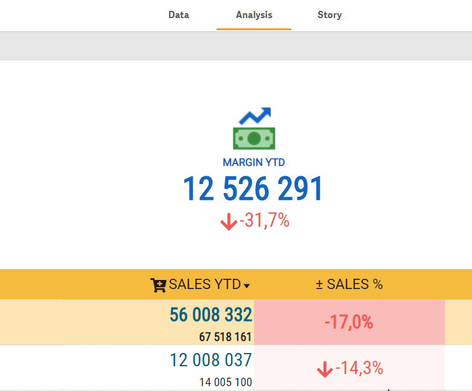

# Show tooltip

The action will allow to create custom tooltips.

The "**Value**" parameter defines the tooltip content. HTML can be used to format the content.

A Qlik expression can be used in the “Value” parameter by prefixing it with an equals sign.

