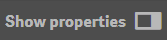
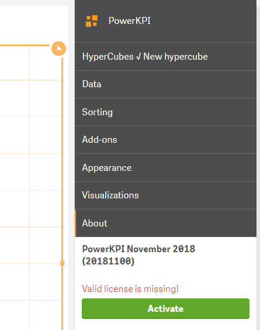
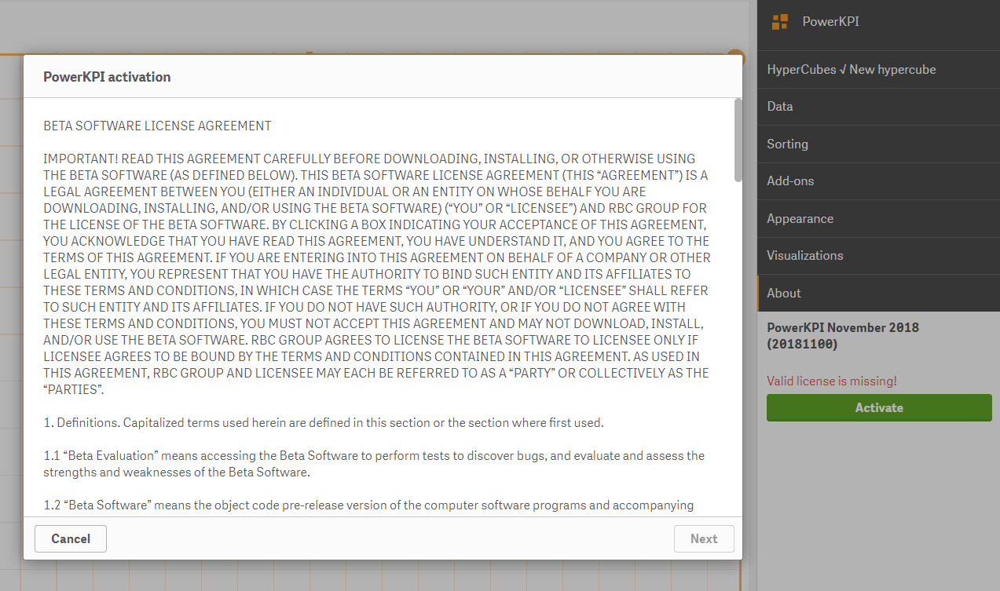
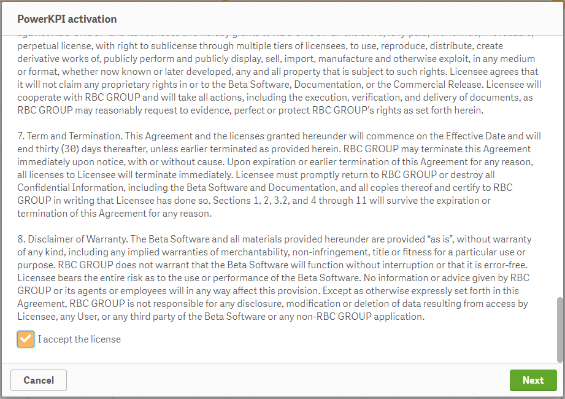
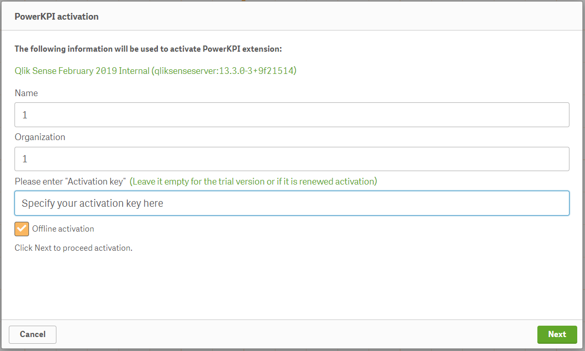
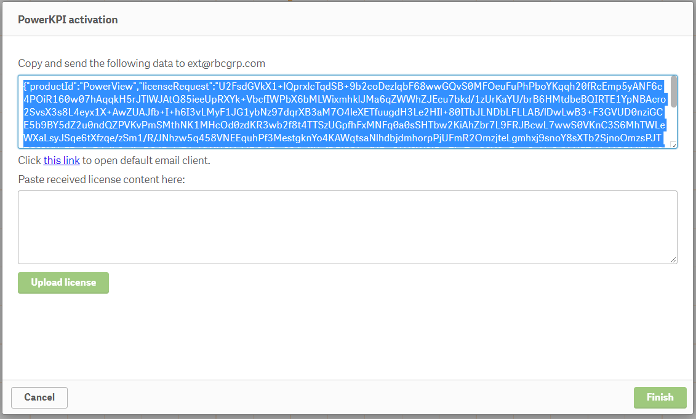
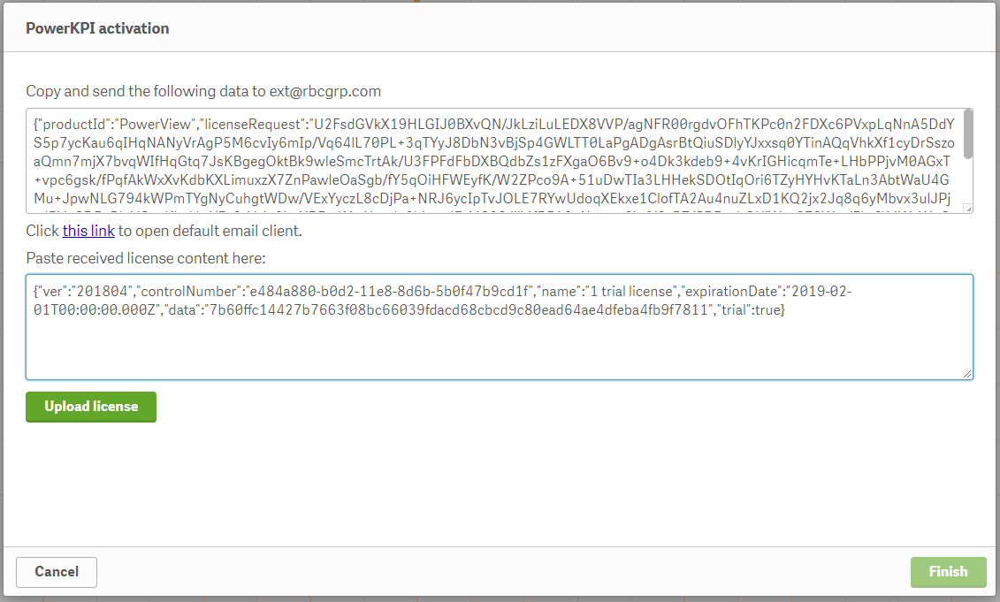
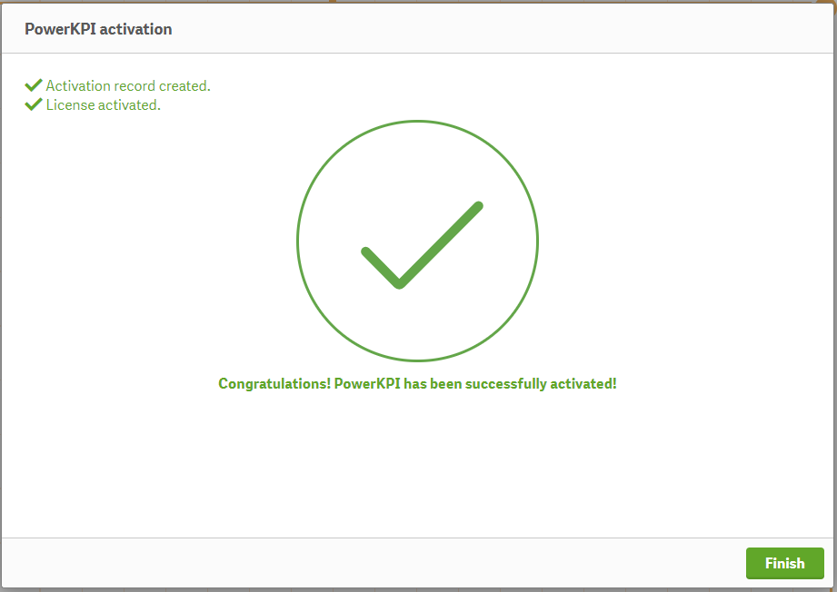

# Offline activation

If you don’t have an internet connection for some reason or some kind of problem has occurred during online activation, there is the offline activation option.

The following steps should be taken to activate the extension using offline option:

**1.** **Create an empty application on a server and place the extension on the sheet.**

**2.** **Open “About” section on the properties panel.**


The properties panel is available on the right-hand side when you are editing a visualization or a sheet. If it is hidden, click  in the lower right-hand corner.


You will see the version of the extensions along with the message “Valid license is missing”.

**3. Click “Activate” button to start the activation process.**

After clicking the “Activate” button, you will see the activation dialog.

**4. On the first page you read software license agreement and scroll down the text.**

**5.&#x20;
At the end of the license you set “I accept the license” checkbox and click the “Next” button.**

**6. Specify your activation key on the appropriate page of the activation dialog and set “Offline activation” checkbox.** ** **Proceed offline activation by clicking the “Next” button.


Leave the “Activation key” field empty if you are making a trial activation request.&#x20;


**7. Following the instructions on the next page you copy the displayed text and send it by email to** [**ext@rbcgrp.com**](mailto:ext@rbcgrp.com).

**8. Some time later, you will receive an email with the valid license which you should paste into the textbox below the label “Paste received license content here” and then click the “Upload license” button.**

After clicking “Upload license”, you will get the message “Congratulations! PowerKPI has been successfully activated!”.


If you have any questions regarding the activation process, feel free to contact us at [https://support.rbcgrp.com/](https://support.rbcgrp.com)

