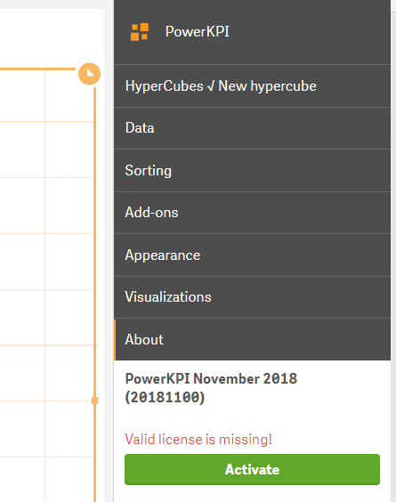
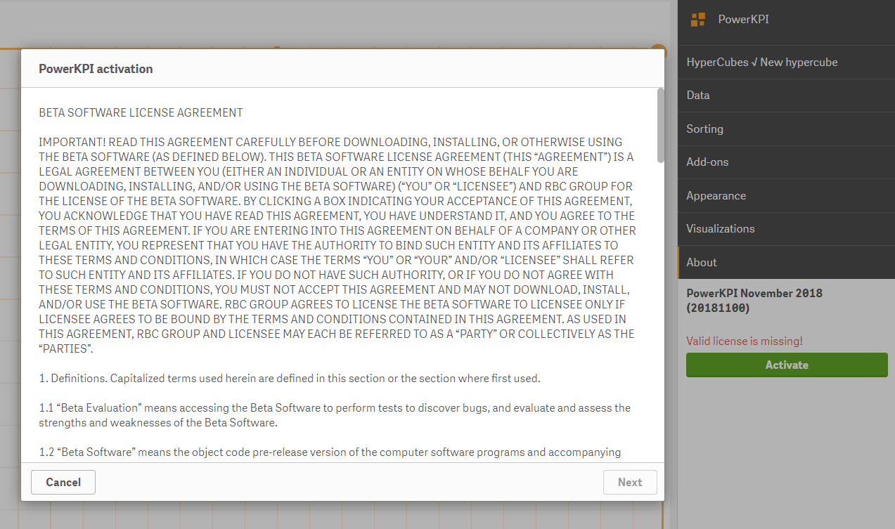
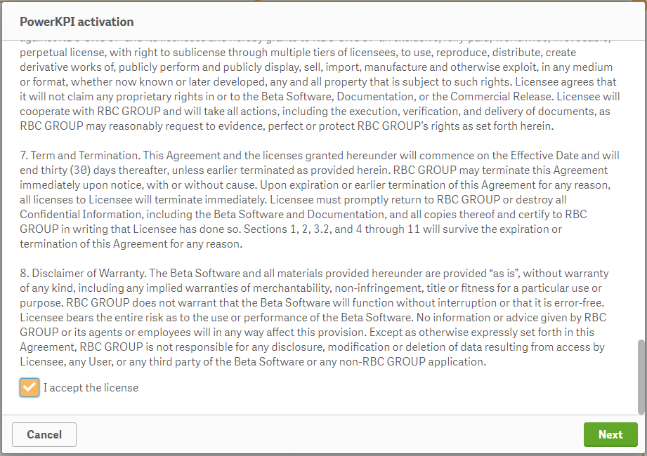
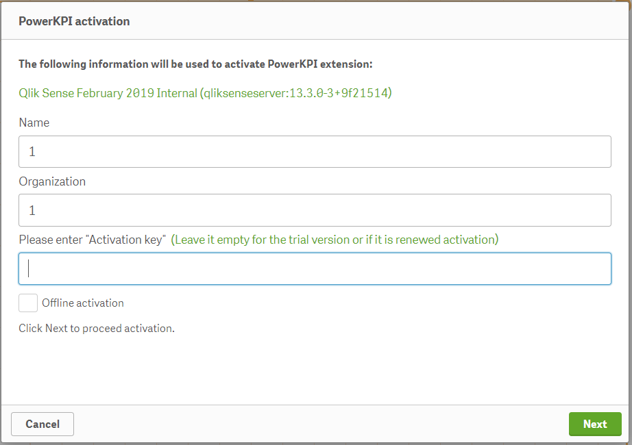

# Online activation

The following steps should be taken to activate the extension:

**1.** **Create an empty application on a server and place the extension on the sheet.**

**2.** **Open “About” section on the properties panel.**


The properties panel is available on the right-hand side when you are editing a visualization or a sheet. If it is hidden, click  in the lower right-hand corner.


You will see the version of the extensions along with the message “Valid license is missing”.

**3. Click “Activate” button to start the activation process.**

After clicking the “Activate” button, you will see the activation dialog.

**4. On the first page you read software license agreement and scroll down the text.**

**5. 
At the end of the license you set “I accept the license” checkbox and click the “Next” button.**

**6.  On the next page you enter your activation key received while purchasing the product.**



 Leave the “Activation key” field empty if you are making a trial activation request.


**7. Click the “Next” button to finish the activation.**

After the successful activation you will get the message “Congratulations! PowerKPI has been successfully activated!”.


If you have any questions regarding the activation process, feel free to contact us at [https://support.rbcgrp.com/](https://support.rbcgrp.com/)


