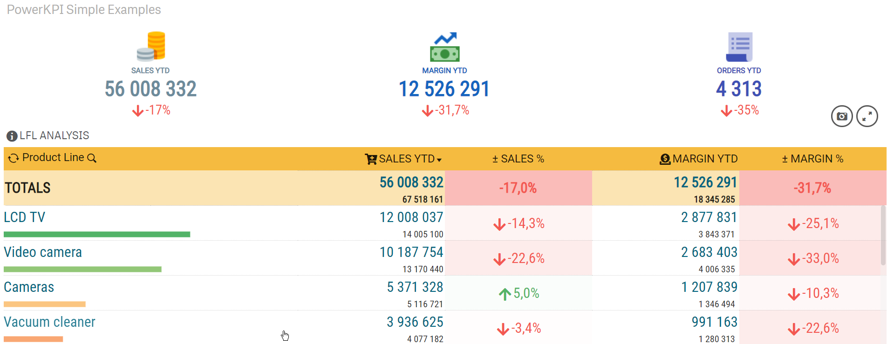
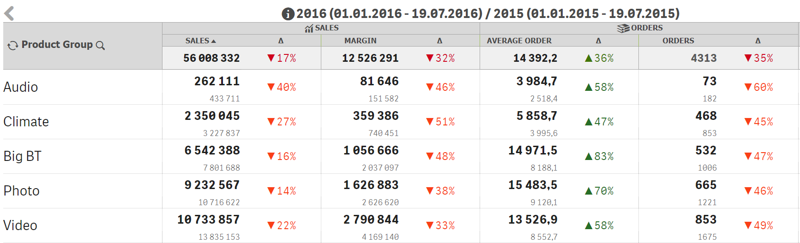
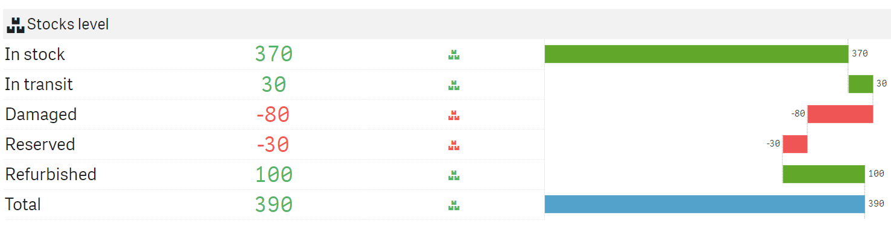

# Demo Apps

The following app is a simple PowerKPI features demo. The demo app contains randomly generated sales data and contains simple examples which demonstrates features of PowerKPI component.


PowerKPI features demo app


The PowerKPI component should be installed to be able to play around with the demo app.


[installation.md](installation.md)



Some business demo apps are available on our Qlik Sense Demo portal. To see more demos feel free to contact us in one of the preferable way following [https://www.rbcgrp.com/en/contacts/](https://www.rbcgrp.com/en/contacts/) link.


Some screenshots from the demo app.

