# Features overview

PowerKPI component allows developers to visually design stunning-looking, responsive and interactive dashboards using **spreadsheet-like visual editor**: from simple kpi to interactive fancy and stunning-looking "table-like" data views (with the ability to build custom multiline detailed row templates).

See also [What's new](whats-new.md) for the latest version.

See Demo Apps for more details.


[demo-apps.md](demo-apps.md)


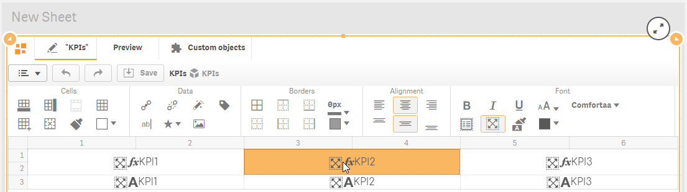


[visual-editor](visual-editor/)


It allows developers to apply styles on a business visualization template using **fonts**, **backgrounds**, **images, borders, alignments, colors, icons**, etc. You can apply color on any cell, cell borders, and text using user-friendly color dialog.

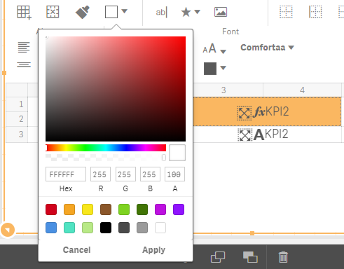

Borders panel allows you not only to apply borders to cells, but also to set the style, thickness and color of lines.

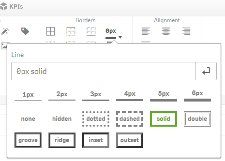

If you need to get a more expressive way of visualizing KPIs, just select and apply the appropriate font, set text color, vertical and/or horizontal alignment, make it responsive, multiline for a long text,

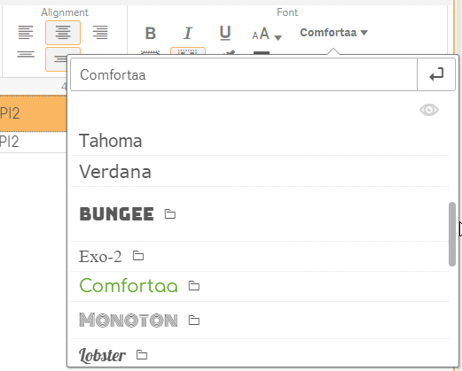

or add images and icons to make your KPIs more readable.

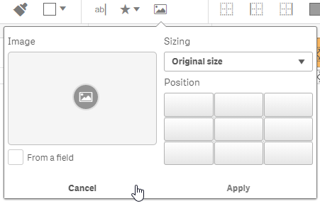

PowerKPI is prepackaged with a **set of fonts**, which can be used to format numbers and text. Also, there is a set of **icon fonts** included. You can even extend the provided set of fonts with your own ones.


[font.md](visual-editor/font.md)


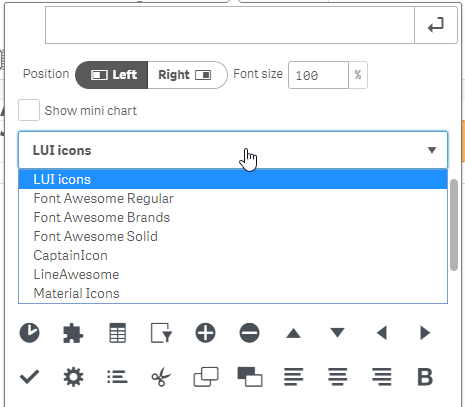

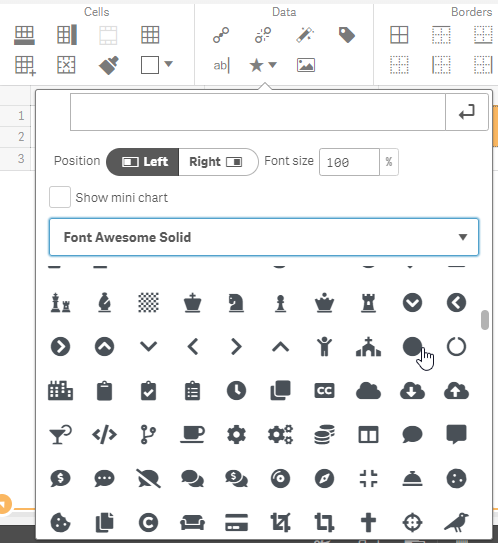

Icons can be displayed based on the expression entered in “Symbol” parameter of a dimension/measure:

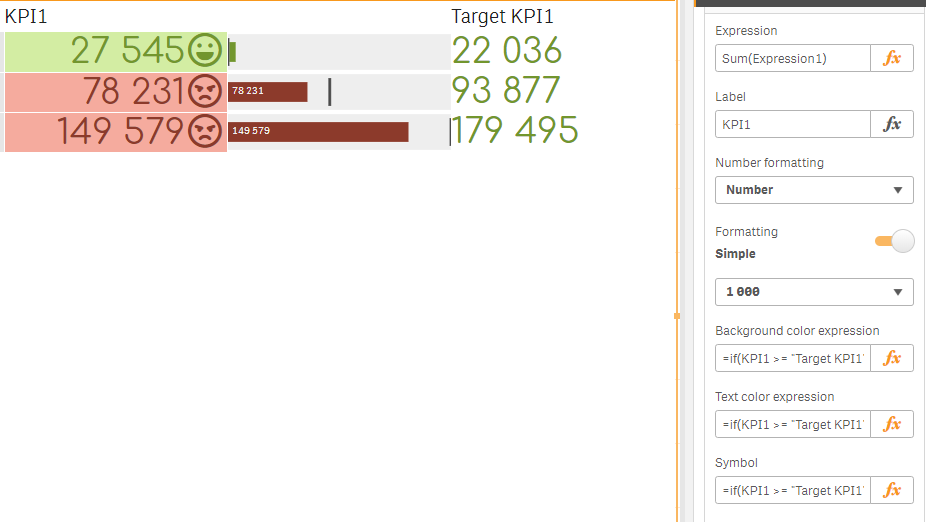

Data configuration made using dimensions and measures doesn’t differ from making it using standard charts: use drag and drop or standard properties panel. You can even add and use **alternative dimensions and measures**, which will be available for business users in your visualizations to choose during the analysis.

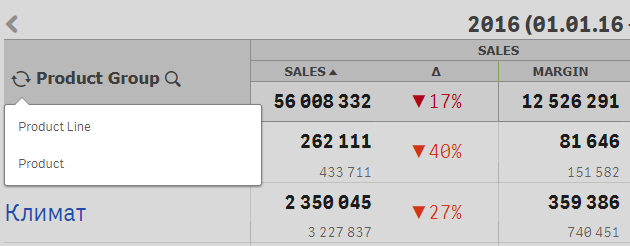

Apart from all standard configuration capabilities, like sorting and add-ons, there is a possibility to add an **unlimited number of visualizations templates and hypercubes** with their own sets of dimensions and measures** **in one component in order to be able to make not only dimensions drills, but also to make “drill into kpi” feature.


[hypercubes.md](properties/hypercubes.md)



[visualizations.md](properties/visualizations.md)


Using simple drag and drop (or double click) it is easy to bind dimensions and measures with the appropriate cells of a visualization template.

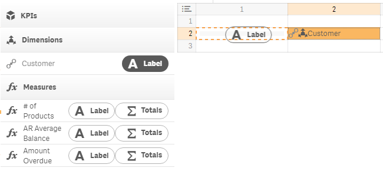

It is easy to preview your template in the edit mode.

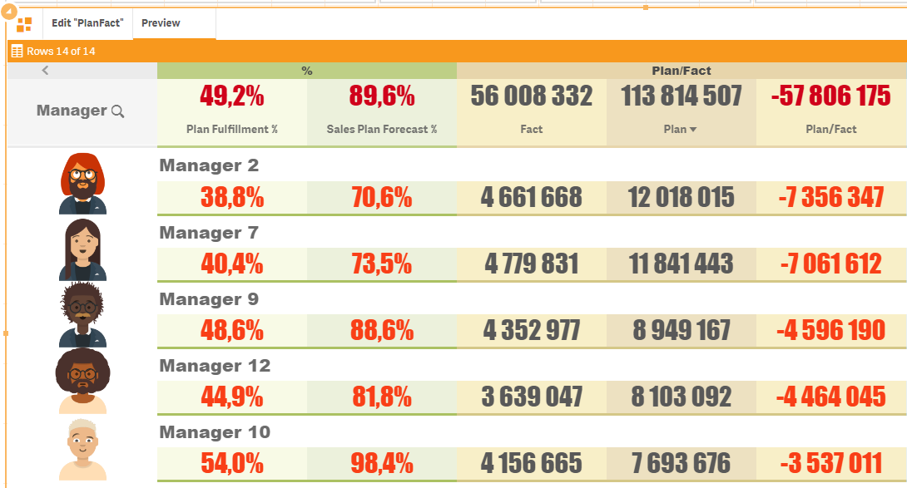


\
Sometimes you need not only to show KPIs based on current selections, but also, in many cases, to activate another data view with an absolutely different set of dimensions and measures.

Just add an unlimited number of data views bonded each with its own set of dimensions and measures, including alternative ones. You can then easily switch between visualization templates in the design mode using properties panel or a special menu in the top left corner.

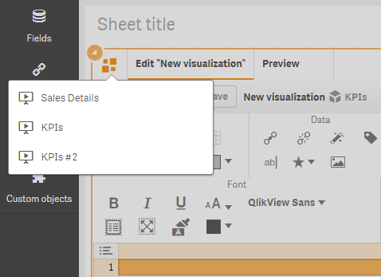

A visualization template can be activated based on user interactions using actions or conditionally, with the help of expression, using the name of the visualization template in “Show” property of the properties panel.

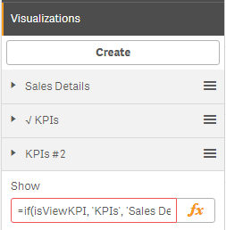

&#x20;There is a **predefined set of actions** based on Qlik stable API:

*
  “**Set variable**” action allows you not only to create and set variables with custom values or using expressions, but also to set variables based on dimensions and measures values of a “current” dataset row
* “**Activate view**” action allows you to interactively visualize one from the predefined sets of visualization templates. Users can activate views manually in accordance with user interactions (clicking and tapping) or conditionally - using expression
* “**Go to sheet**”, “**Next sheet**”, “**Previous sheet**”, “**Go to story**”, “**Go to url**” allows business users to open the appropriate business data context in just one click – sheet, story or even another application
* “**Select values**”, “**Select all**”, “**Select match**”, “**Select alternative**”, “**Select possible**”, “**Select excluded**”,  “**Toggle select**”, “**Clear**”, “**Clear all**”, “**Clear other**”, “**Lock**”, “**Lock all**”, “**Unlock**”, “**Unlock all**”, “**Create bookmark**”, “**Apply bookmark**”, “**Remove bookmark**” set of actions allows you to extend standard based selections model with custom selections scenarios during user interaction with  data visualizations
* “**Reload**”, “**Partial reload**” actions allow you to load data on demand
* “**Export data**” allows you to export data not only from the current data view but also from any predefined master visualization item
* “**Value color**” and “**Mini chart**” actions allow you to represent numbers in one of the graphically predefined ways
* “**Zoom in**” and “**Zoom out**” actions allow you to expand visualization in full screen mode and close it
* “**Sort**” allows you to apply or remove interactive sorting capability for each column separately (in case of table representations)
* “**Alternative dimensions/measures**” action allows you to apply or remove interactive dimensions and measures buttons separately for each data column labels
* “**Searchable dimension**” allows you to apply or remove search functionality for each individual dimension column.


[actions](actions/)


You can apply a set of actions on any cell or cells to make the view more interactive.&#x20;

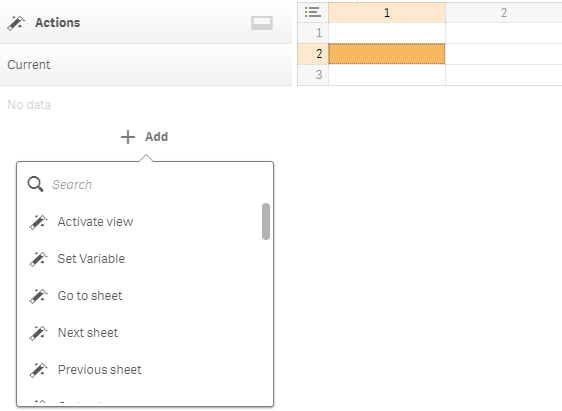

See Actions section of this documentation for more details.

You can use master item library colors or conditionally control color with the help of expressions (background and text colors), or even easier - apply “Value color” action.

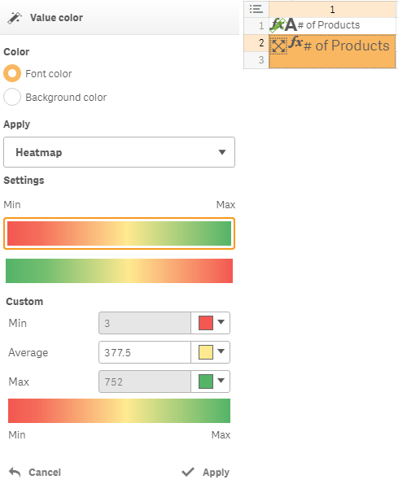

It is easy to add and customize histogram mini chart in your data view template using “Mini chart action”.

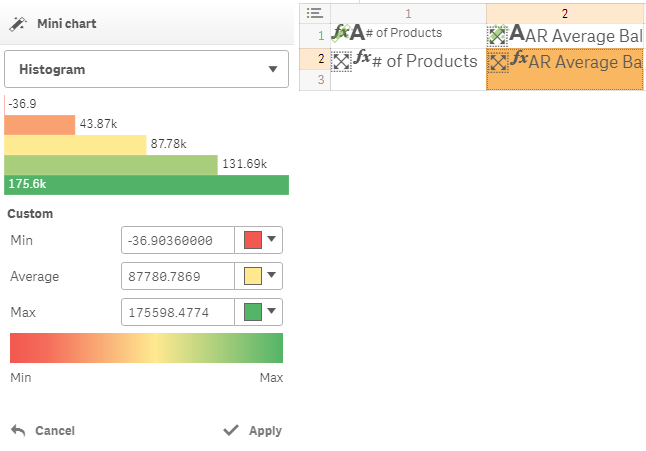

Use one from a predefined set of minicharts to visually represent your KPIs. As an example, developers can design tables with waterfall charts in the columns.

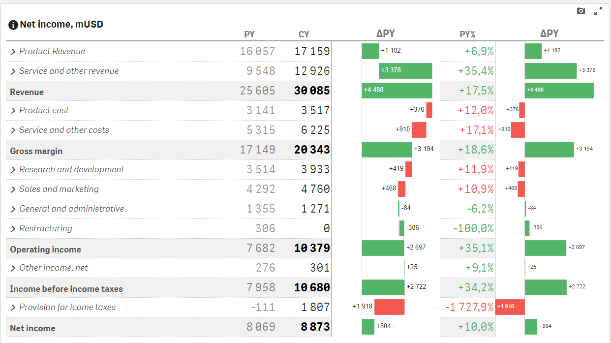

See “Mini chart” action of the documentation for more details.

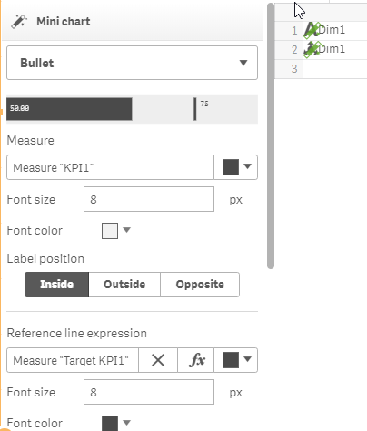

Apart from the advanced features, there are also standard Qlik Sense features available: **dimensions limits**, **null values and data handling**, **calculation conditions**, **background and text colors expressions**, **library color support**, **formatting**, **totals**, **sorting**, etc.
