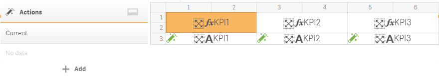
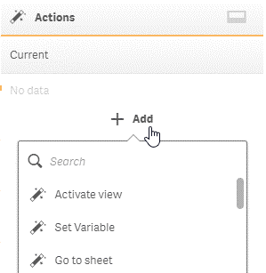
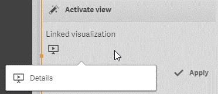
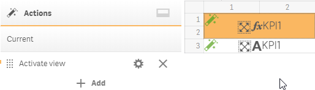

# Actions

But remember what the reason to build “Details” visualization was. We have a requirement to build an interactive dashboard with the ability to “drill into kpi” from the simple kpi view to the detailed one.

PowerKPI component has a predefined set of actions which can be applied to any cell of our template. One of such actions is “Activate view” action. You can apply it on a cell with KPI.

Open “KPIs” template in the edit mode by clicking .png>)button in the top left corner. Open “Actions” panel by clicking "Actions" .png>) toolbar button (or use "Ctrl + Shift + A" keyboard shortcut to do the same).&#x20;

Select the appropriate cell (with KPI1, for example).

Click “+ Add” button on “Actions” panel. The “Activate view” action will be the first item in the list. Click it.

It will open “Actions” parameters panel. In our particular case there is only one parameter – “Linked visualization”, which will be opened when user clicks on the KPI.

If you click on the icon below “Linked visualization” title, you will get a list with available visualizations. In our case it should be only one - “Details”.

Select it and click “Apply” button. “Activate view” item will be shown on the “Actions” panel and a special icon .png>) will be shown in the top left corner of the selected cell.

Save all changes clicking "Save" .png>) button.

