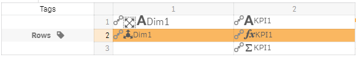
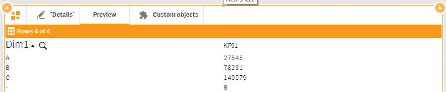

# Visualizations

After adding the dimension and measures to the “Data” section, you are ready to start building a new visualization template.

Hit “New” button .png>)  to add a new visualization template. A new template will be created and the “Visualization” section of the properties panel should contain two items.

Both visualizations are called “New visualization”. You can change the titles for each of item. Expand the first item of the “Visualizations” section of properties panel and change the title to “KPIs”, expand the second one and change it to “Details”.

You can easily switch between visualization templates using special button  .png>)in the top left corner of the component.


Switching between visualization templates you also switch between hypercube’s definitions. “Data”, “Sorting” and “Add-ons” sections of the properties panel can be used to change the properties of the currently active hypercube


Open “Data” section and try to switch between visualizations. So, when you switch between visualizations, data panel will contain dimensions and measures for currently active visualization.

You should get back to “Details” template. Add 2 columns and 3 rows to it.&#x20;

We are going to build a simple table view. Drag and drop data items from “Dimensions / Measures” panel to the template as it is shown in the figure below.

Open “Preview” tab to see what you have.

Return to the edit mode by clicking “Details” tab.&#x20;

Building table-like views in such a way, we need to specify which row/rows is/are details rows of the current template. For that purpose, open “Tags” panel by clicking "Tags" .png>)  toolbar button on the panel “Data” of the editor toolbar.&#x20;

Select the second row clicking on the cell with row number “2” and then click on the “Rows” tag.

You should get a layout as it is shown in the figure below.

Open “Preview” tab to see what you get now.

You can suppress null value for the used dimension “Dim1”. Open “Data” section, expand “Dim1” and uncheck “Include null values” parameter. That’s it for now.

