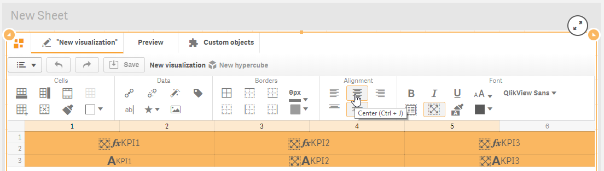
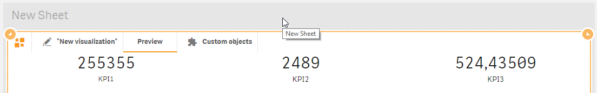
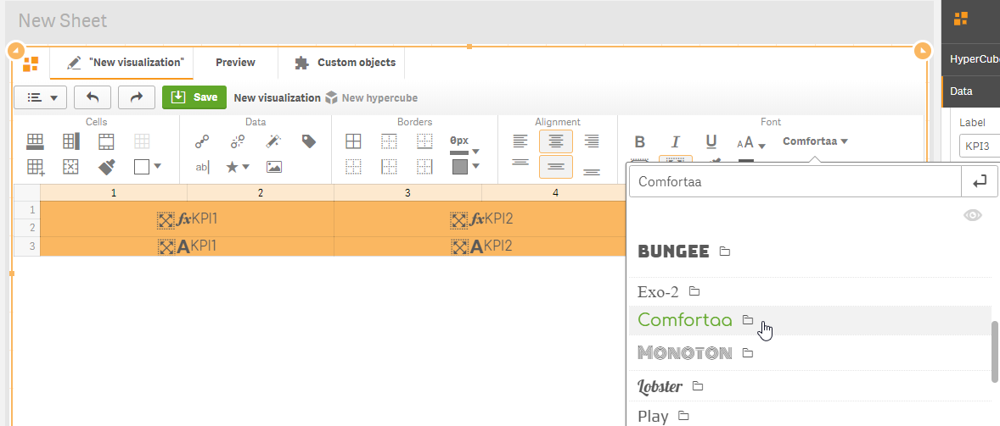
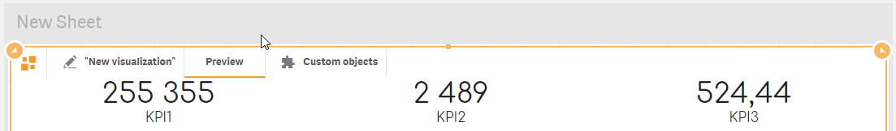

# Formatting

Select appropriate cells containing measures and labels. You can make the selection by holding Ctrl key and clicking the required cells or making range selections from top left corner down to bottom right corner holding right mouse key.

To horizontally center all data inside each selected cell, click "Center"   toolbar button \(or use "Ctrl + J" keyboard shortcut\).

Apply vertical middle alignment clicking "Middle" toolbar  button \(or use "Ctrl + Alt + J" keyboard shortcut\).

Click “Preview” tab.

Numbers and labels are now properly aligned. 

Go to Data section of the property panel, expand the first measure and set approppriate number format. Apply similar number formatting with all measures. During format changing you will immediately see changes in “Preview” mode.

Let's apply another font on our KPIs. Return to edit mode by clicking "New visualization" tab  . Cell selections should still remain active. Change font to Comfortaa, for example.


Open “Preview” again to be able to see the latest changes.

