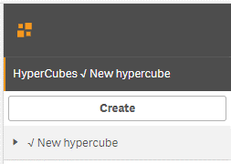
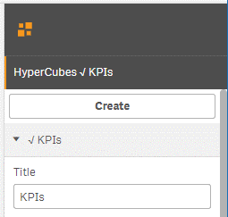
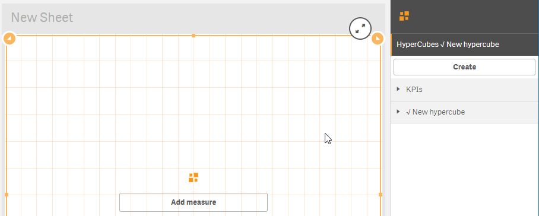
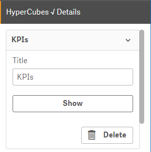
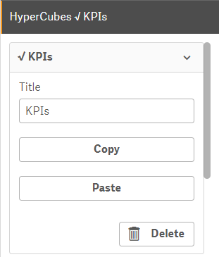
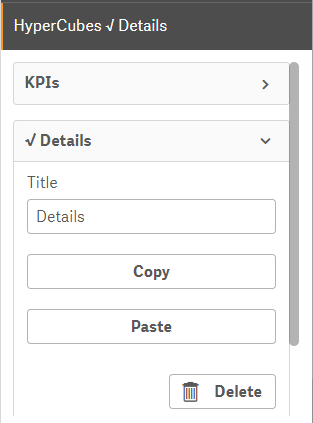
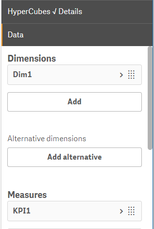

# Hypercubes

Suppose we want to have a possibility to drill into each particular KPI to be able to make some detailed analysis. In other words, clicking particular KPI should allow us to switch to another analysis context \(another visualization template with a different set of dimensions and an expanded set of measures\).

One of the interesting features of PowerKPI is the ability to define unlimited number of visualization templates bonded to different definitions of dimensions and measures \(**Hypercube** in Qlik Sense technical term\).

Let's expand **HyperCubes** section \(the first section\) on the properties panel. 

You already have one HyperCube here called “New hypercube”. It has been created when you added extensions to the sheet.

Rename it to something meaningful, for example – “KPIs”. Expand “New hypercube” item and change “Title” property accordingly. Thus, the current configuration of dimensions and measures which you can see on the "Data" section of properties panel will be called “KPIs”.

Let's create another hypercube called “Details”. Click “Create” button of the “HyperCubes” section. A new hypercube will be added. If you open the Data section of the properties panel, it will be empty.

To switch back to “KPIs” hypercube, expand it in “Hypercubes” section and click “Show” button. 

The “Data” section should contain all previously created dimensions and measures, and the editor should show previously designed visualization template. 

Expand "KPIs" hypercube again and click "Copy" button. In such way, in one click, we can copy dimensions and measues configured for the hypercube.

Switch back to the “New hypercube” in the same way as you did it for “KPIs” \(expand it and click "Show" button\). 

Paste copied measures by clicking "Paste" button.

Change the title for the newly created hypercube to “Details”. 

Expand the “Data” section of the properties panel. It should contain the copied measures. Let's add a dimension using field "Dim1".

After adding the required dimension and measures on the “Data” section, you are ready to start building a new visualization template to implement drill-down feature.

