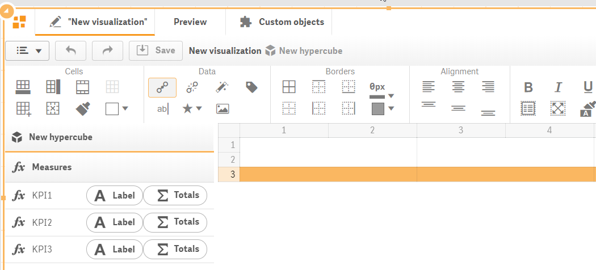
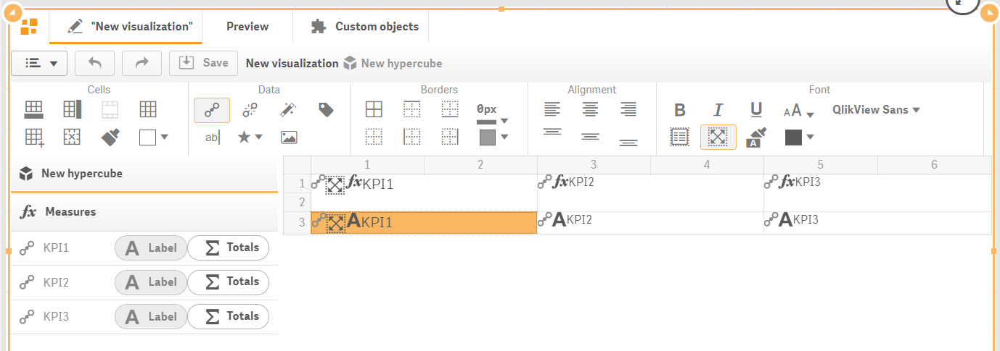
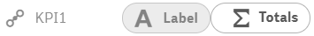
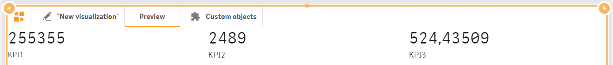
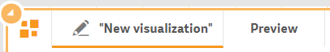

# Measures binding

To start binding dimensions and measures, click "Dimensions/Measures"  toolbar button. Data panel with configured dimensions and measures will be opened along with the visualization template.

Data panel will show all measures which have been added on Data section of property panel.


Each dimension and measure contain “Label” button, which will allow you to bind dimension/measure label within the template. 

Each measure, except the “Label” button, contains “Totals” button. It allows you to bind total calculated for the appropriate measure within the template. It makes sense to use “Totals” when constructing table-like templates. 

To bind a measure/dimension with the appropriate cell, select a cell and click the appropriate measure/dimension. Or, if you prefer, drag the data item \(dimension or measure\) onto the template and drop it on the appropriate cell. In such a way you will bind your data assets \(dimensions and measures\) with the designed template.

Bonded item will become gray and data asset item icon will change accordingly.

Click “Save” button to save changes.

Click “Preview” tab on top of the component editor to preview the visualization.

To improve our visualization template, we should make some further steps - apply alignment, fonts and number formatting. 

Switch back to edit mode by clicking editor tab \(with pencil icon before template name – “New visualization” in our case\).

