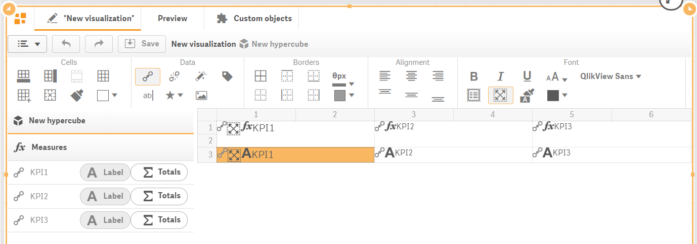

# Template design

To start building a dashboard using the PowerKPI extension component, just drag-and-drop it on a sheet from the "Extensions" section of the "Custom objects" of the Qlik Sense assets panel.


See the description of the assets panel in Qlik help:&#x20;

[https://help.qlik.com/en-US/sense/February2019/Subsystems/Hub/Content/Sense\_Hub/Assets/assets-panel.htm](https://help.qlik.com/en-US/sense/Subsystems/Hub/Content/Sense\_Hub/Assets/assets-panel.htm)


Next, open the “**Data**” section of the properties panel and add measures. One measure is the minimum requirement to start building a simple dashboard. Suppose it should be SUM(Expression1).


You will have a possibility to add dimensions, measures and alternative ones. There are no constraints regarding the quantity of the used dimensions and measures.


After adding a measure, you will be able to open a view data window or create a visualization template.

By clicking “View data” button, you will open a data preview. You can continue to add measures and dimensions and see the appropriate data changes in the preview.

Add two additional measures: SUM(Expression2) and SUM(Expression3).&#x20;

Set measures labels to "KPI1", "KPI2", "KPI3".

In data preview mode hit “**New**” button or open “Visualizations” section on the properties panel and hit “**Create**” button. Visualization spreadsheet-like editor will be opened instead of data preview.

A visualization template consists of cells which can be added, merged, removed in the same manner as you would do it in a spreadsheet-like editor. To start adding columns and/or rows, click “Add “Rows”   and/or “Add columns”  toolbar button.


To insert a row, use "Shift + Insert" keyboard shortcut. To insert a column, use "Ctrl + Shift + Insert" keyboard shortcut


To merge cells, you should select cells from top left corner to bottom right corner. You can even select the entire column or row by clicking row or column header (the cell with a number displayed).

After selecting cells, you can merge them by clicking "Merge" toolbar button.


To merge selected cells, use "Ctrl + M" keyboard shortcut&#x20;


To split merged cells, select a cell and click "Split"  toolbar button.


To split merged cells, use "Ctrl + Alt + M" keyboard shortcut&#x20;


To remove a row or a column, you should select the entire row/column and hit "Delete"  toolbar button.

In such a way, by adding columns and rows, merging them, you will design your visualization template (which can be improved later) and will be ready to bind measures with the visualization.

To start binding dimensions and measures, click "Dimensions/Measures"  toolbar button. Data panel with configured dimensions and measures will be opened along with the visualization template.

Data panel will show all measures which have been added to the Data section of the properties panel.


Each dimension and measure contain “Label” button, which will allow you to bind dimension/measure label within the template.&#x20;

Each measure, except the “Label” button, contains “Totals” button. It allows you to bind total calculated for the appropriate measure within the template. It makes sense to use “Totals” when constructing table-like templates.&#x20;

To bind a measure/dimension with the appropriate cell, select a cell and click the appropriate measure/dimension. Or, if you prefer, drag the data item (dimension or measure) onto the template and drop it on the appropriate cell. In such a way you will bind your data assets (dimensions and measures) with the designed template.

The bonded item will become grey and the data asset item icon will change accordingly.

Click “Save” button to save changes.

Click “Preview” tab on the top of the component editor to preview the visualization.


KPIs values should differ from the ones on the picture because of random nature of the generated script


To improve our visualization template, we should make some further steps - apply alignment, fonts and number formatting.
