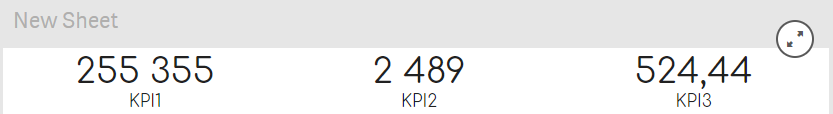
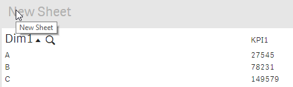
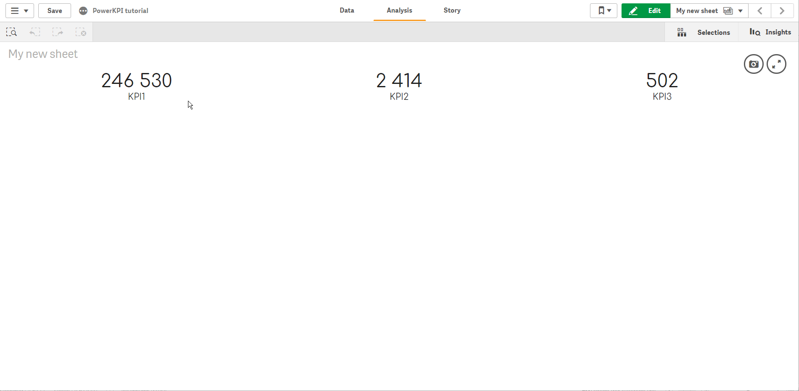

# The final result


The final app is available to download:



Power KPI tutorial.qvf


You can test how it works now. Stop editing your sheet (if Qlik Sense is still in the edit mode) by clicking "View" .png>) button (or "Done" .png>) button if you use an older version of Qlik Sense).&#x20;

Your visualization should look like this:

If you click on “first number”, you should drill into our detailed view:

It should look and function like this:

Feel free to improve the current solution – try to add “Back” button to the “Details” template and apply various formatting options, cell borders, fonts, or even actions.

In this tutorial we have used only one feature of PowerKPI component. See “Features overview” section of the documentation for more details and available features of the component.
