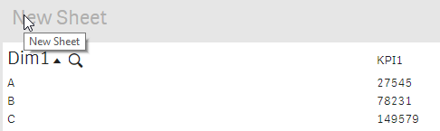
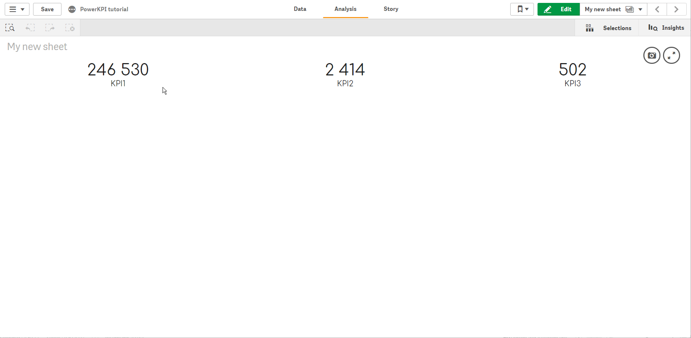

# The final result


The final app is available to download:




You can test how it works now. Stop editing your sheet \(if Qlik Sense is still in edit mode\) by clicking "View"  button \(or "Done"  button if you use older version of Qlik Sense\). 

Your visualization should look like this:

If you click on “first number”, you should drill into our detailed view:

It should look and action like this:

Feel free to improve the current solution – try to add “Back” button on “Details” template and apply various formatting options, cell borders, fonts, or even actions.

In this tutorial we have used only one feature of PowerKPI component. See “Features overview” section of the documentation for more details and available features of the component.

