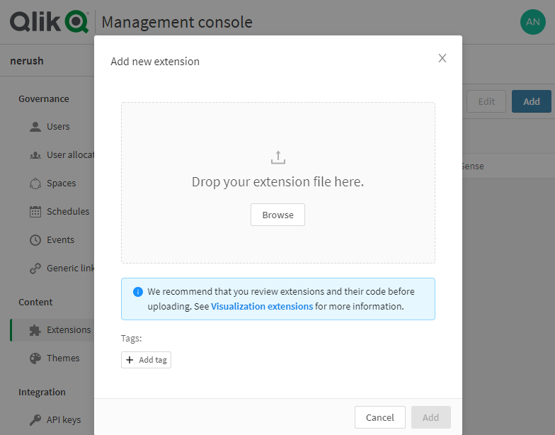
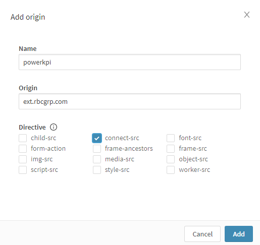

# Installation

Download the latest version of the extension from [powerkpi.rbcgrp.com](https://powerkpi.rbcgrp.com).

## How to install extensions on Qlik Sense Desktop

1. Navigate to the Extensions folder at C:\Users\&lt;username&gt;\Documents\Qlik\Sense\Extensions
2. Create a new folder and give it powerkpi name
3. Unzip downloaded powerkpi.zip file to the new folder

## How to install extensions on Qlik Sense Enterprise or Qlik Analytics Platform

1. Navigate to the QMC
2. In the left menu, under "Manage Resources", find and click on "Extensions"
3. Click "Import" on the bottom nav bar
4. Click "Choose File" and navigate to the downloaded extension powerkpi.zip
5. Click "Import" to finish
6. Activate Power KPI component \(go to [Activation ](activation/)page for more details\).


PowerKPI extension needs to be activated after importing it on Qlik Sense Enterprise Server. See the [**Activation** ](activation/)section of this documentation for more details.


## How to install extension on Qlik Cloud Services \(Business and Enterprise\)

1. Navigate and login into your qlik cloud tenant.
2. Open management console by clicking on avatar in the top right corner of the tenant hub and select **Administration** menu item**.**

3. In the left menu, under "Content", find and click on "Extensions"

4. Click "Add" button to open up the "Add extension" dialog

5. To add an extension click "Browse" button, select powerkpi.zip file and then click "Add".

6.  In the left menu, under "Integration", find and click on "Content Security Policy" and then click "Add" button.

7. Add new content security policy item by filling up the following parameters under the "Add origin" dialog window and then click "Add" to finish with it:

* Name: powerkpi
* Origin: ext.rbcgrp.com
* Directive: connect-src

8. Activate Power KPI component \(go to [Activation ](activation/)page for more details\).


 The installation process is also described in Qlik Sense Help.

[https://help.qlik.com/en-US/sense-developer/Subsystems/Extensions/Content/Sense\_Extensions/Howtos/deploy-extensions.htm](https://help.qlik.com/en-US/sense-developer/Subsystems/Extensions/Content/Sense_Extensions/Howtos/deploy-extensions.htm)




