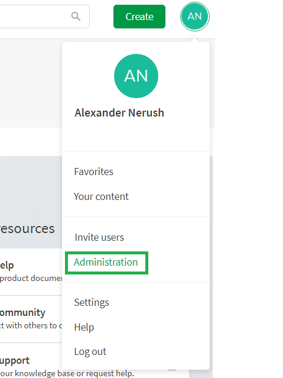
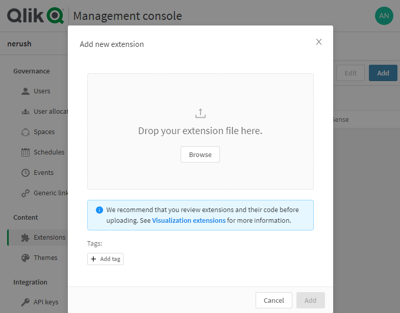
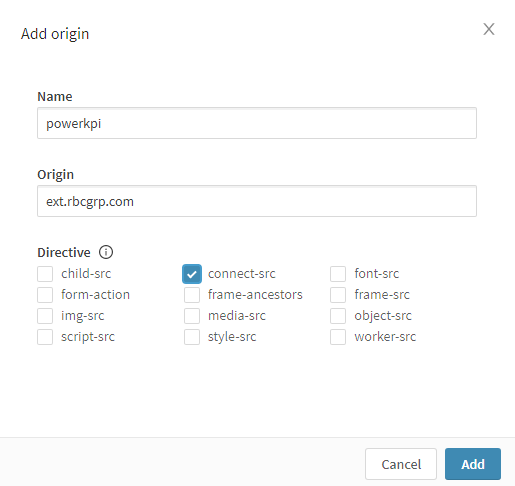

# Installation

This section describes how to install the extension on various versions of Qlik Sense.

Download the latest version of the extension from [powerkpi.rbcgrp.com](https://powerkpi.rbcgrp.com).&#x20;

## Qlik Sense Desktop

1. Navigate to the Extensions folder at C:\Users\\\<username>\Documents\Qlik\Sense\Extensions
2. Create a new folder and give it powerkpi name
3. Unzip downloaded powerkpi.zip file to the new folder

## Qlik Sense Enterprise on Windows or Qlik Analytics Platform

1. Navigate to the QMC
2. In the left menu, under "Manage Resources", find and click on "Extensions"
3. Click "Import" on the bottom nav bar
4. Click "Choose File" and navigate to the downloaded extension powerkpi.zip
5. Click "Import" to finish
6. Activate Power KPI component (go to [Activation ](activation/)page for more details).


PowerKPI extension needs to be activated after importing it on Qlik Sense Enterprise Server. See the [**Activation** ](activation/)section of this documentation for more details.


## SaaS editions of Qlik Sense (Qlik Sense Business and Qlik Sense Enterprise SaaS), Qlik Sense Enterprise on Kubernetes

1. Navigate and login into your qlik cloud tenant.
2. Open management console by clicking on the avatar in the top right corner of the tenant hub and select the **Administration** menu item**.**

3\.  In the management console, under the "Content" header, find and click on the "Extensions" section.

4\. Click "Add" button to open up the "Add extension" dialog

5\. To add an extension click "Browse" button, select powerkpi.zip file and then click "Add".

6\.  In the management console, go to the "Content Security Policy" section under the "Integration" header and click "Add" in upper the right-hand corner.


If your installation of **Qlik Sense Enterprise on Kubernetes** misses "Content Security Policy" skip steps 6 - 7 of this instruction and go to the activation step.


7\. Add new content security policy item by filling up the following parameters under the "Add origin" dialog window and then click "Add" to finish with it:

* Name: **powerkpi**
* Origin: **ext.rbcgrp.com**
* Directive: **connect-src**

8\. Activate Power KPI component (go to [Activation ](activation/)page for more details).


&#x20;The installation process of visualizations extensions is also described in Qlik Sense Help.

[https://help.qlik.com/en-US/sense-developer/Subsystems/Extensions/Content/Sense\_Extensions/Howtos/deploy-extensions.htm](https://help.qlik.com/en-US/sense-developer/Subsystems/Extensions/Content/Sense\_Extensions/Howtos/deploy-extensions.htm)



[activation](activation/)

