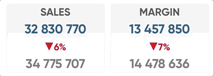

# Appearance

.png>)

It allows you to set title, subtitle and footnote.

.png>)

“Alternate states” subsection can be used to apply an alternate state for an object. See Qlik Sense documentation for more details.

.png>)

“Settings” subsection allows you to disable and hide “Export”, “Export data”, “View data” context menu options.&#x20;


<figure><figcaption><p>Custom settings</p></figcaption></figure>


.png>)

It also allows you to replace url in a browser adding a hashtag link of the active visualization using History API. Such option can be activated by setting "Replace "URL".

.png>)


With custom themes developers can style Power KPI visualizations by applying custom classes using the "**CSS classes**" parameter.

<figure><figcaption></figcaption></figure>

For example, by defining the following classes inside a custom theme, you can achieve the following effects:

```css
.qv-object-powerkpi .powerkpi-theme {
  background: linear-gradient(#f2f2f2, white) !important;
  border: solid 1px #f2f2f2;
  border-radius: 5px;
}

.qv-object-powerkpi .powerkpi-theme:hover  {
  background: linear-gradient(#CFF0F8, white) !important;
  border: solid 1px #3b93bd;
}
```

<figure><figcaption></figcaption></figure>
