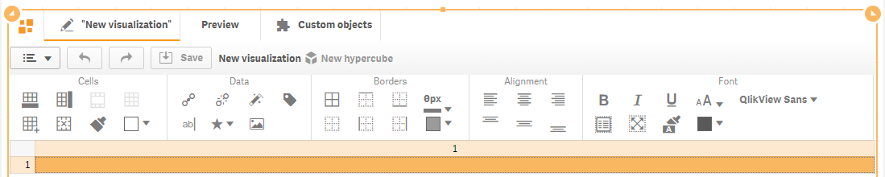
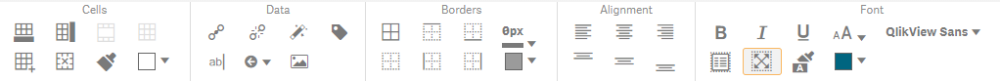

# Visual editor

Visual editor allows you to create and edit visualization templates, which can be added using property panel of the component \(see section “Visualizations” of the documentation\).



Spreadsheet-like visual editor allows developers to visually design stunning-looking, responsive and interactive visualizations: from simple kpi to interactive fancy and stunning-looking "table-like" data views \(with the ability to build custom multiline detailed row templates\).

To create an appropriate visualization template, you should add columns/rows, merge cells in accordance with the requirements. You should bind dimensions and measures with the template, and then apply various styles options – fonts, alignment, borders, colors, backgrounds.

In the top left corner of the toolbar panel there is a button which allows a quick and easy switch between visualization templates.

To preview visualization, click “Preview” tab at the top of the toolbar.

“Custom objects” tab allows you preview and apply a predefined visualization template.

Tab with pencil icon along with visualization title allows you switch back to edit mode.

Button  on the toolbar panel allows you to open context menu, which allows copying, exporting and importing designed templates as well as opening template settings panel.


Settings panel allows you to set “Fit to height” parameter, which will shrink or stretch visualization to fit occupied area. It is recommended to set this option on visualization templates for dashboards.

“Background image” allows you to set image as background for template. 

“Thumbnail” allows you to set thumbnail for template.

Toolbar also has buttons to “undo/redo” changes and “Save” button, along with template and hypercube titles.

Visualization template is displayed in the form of spreadsheet-like view with cells below the toolbar.

To be able to merge cells, you should select cells from top left cell to bottom right cell holding left mouse button.


To apply some operations on several cells you should select them holding "Ctrl" key.

To select an entire column, you should click the column header \(cell with a column number\). In such a way, by clicking the row number, you can also select the entire row. It is possible to select several columns/rows by selecting corresponding column/row headers.

Main operations are grouped by sections on the toolbar:

*  “**Cells**” operations allow you to add/remove cells, change cells settings;



*  “**Data**” section contains operations which will allow you to bind data items \(dimensions and measures\), apply actions, insert text, icons, images;



*  “**Borders**” will allow you to set borders and border styles on cells;



*  “**Alignment**” will allow you align data horizontally and/or vertically;



*  “**Font**” will allow you to apply font, size and styles/text behavior options.



