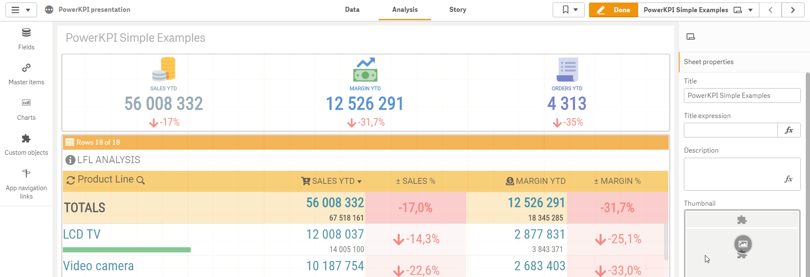

# Visual editor

Visual editor allows you to create and edit visualization templates, which can be added using properties panel of the component \(see section “[Visualizations](../properties/visualizations.md)” of the documentation\).



Spreadsheet-like visual editor allows developers to visually design stunning-looking, responsive and interactive visualizations: from simple kpi to interactive fancy and stunning-looking "table-like" data views \(with the ability to build custom multiline detailed views\).

The "Dimensions/Measures" panel automatically opens up when new visualization created. "Apply all" button allows developers to apply and use all dimensions and measures configured on the data sections of the property panel. It also applies predefined set of actions like "Sort", "Alternative dimensions/measures", "Searchable dimension", "Select dimension value", etc.

To create a custom visualization template, you should add columns/rows, merge cells in accordance with the requirements.  Quick add buttons allows to easily add columns / rows.

You should bind dimensions and measures with the custom template, and then apply various styles options – fonts, alignment, borders, colors, backgrounds. To bind a dimension or measure with the template just double click on a cell or use **Ctrl + Space** \(**⌘ + Space**\)  to open dimensions and measures popup menu and then select an appropriate item. As an alternative, developers can use "Dimensions/Measures" [data](data.md) panel.

Editor context menu can be used to increase a developer productivity. Toolbar panel can also be collapsed to increase the working area and expanded again if need it.

To preview visualization, click “Preview” tab at the top of the toolbar. 

To open up the PowerKPI editor a developer should click on a button  in the top left corner of the component or, as another option, open Visualizations sections on the property panel and then expand an appropriate  visualization and click on the "Edit template" button.

In the top left corner of the toolbar panel there is a button which allows a quick and easy switch between visualization templates \(if several visualizations have been created in one component\).

“Custom objects” tab allows you to preview and apply a predefined visualization template.

Button  on the toolbar panel of the editor allows you to open up a menu, which allows copying, exporting and importing designed templates as well as opening template properties panel \("Show properties" menu item\). 

A developer can use "Export" button to export developed template into a file, a then import it in another component using "Select file..." menu item. In such a way, developers can create own visualization templates library in the form of files on a drive.


To open a template properties panel use "Show properties" menu item.

Properties panel allows to apply “Fit to height” parameter, which will shrink or stretch a visualization to fit the occupied by the component area. It is recommended to set this option on visualization templates without dimensions only.

"Scrolling" options allows to choose between Native or Virtual scrolling mode for tables**.** Native mode is used ****when "Scrolling" option is set. ****Native mode uses native pageable scroll in which the  "Load more" or "Load previous" buttons can be used to load the next or previous page of the data, while virtual scrolling mode allows to scroll the entire dataset.

“Background image” allows adding an image as a background for templates. 

“Thumbnail” allows setting a thumbnail for templates.

"Fit to height" mode can also be applied with the help of a quick button in the visual editor \(see image below\). ****

The toolbar also has buttons to “undo/redo” changes and a “Save” button, along with template and hypercube titles.

The visualization template is displayed in a spreadsheet-like view with cells below the toolbar.

To be able to merge cells, you should select cells from the top left cell to the bottom right cell holding the left mouse button.


To apply some operations on several cells, you should select them holding "Ctrl" key.

To select an entire column, you should click the column header \(the cell with the column number\). In such a way, by clicking the row number, you can also select the entire row. It is possible to select several columns/rows by selecting the corresponding column/row headers.

Main operations are grouped by sections on the toolbar:

*  “**Cells**” operations allow you adding/removing cells, as well as changing cells settings;



*  “**Data**” section contains operations which will allow you to bind data items \(dimensions and measures\), apply actions, insert text, icons, images;



*  “**Borders**” will allow you to set borders and border styles on cells;



*  “**Alignment**” will allow you to align data horizontally and/or vertically;



*  “**Font**” will allow you to apply font, size and styles/text behavior options.



