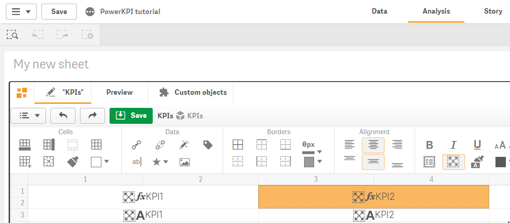

# Alignment

“Alignment” section of toolbar contains the following buttons:

*  - align cell/cells content left
*  - center cell/cells content
*  - align cell/cells content right
*  - vertically align cell/cells content to the top
*  - vertically center cell/cells content
*  - vertically align cell/cells content to the bottom

