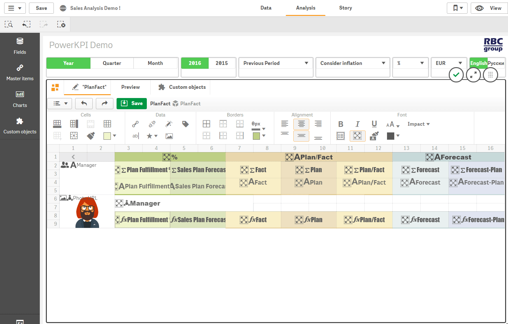

# Borders

“Borders” section of the toolbar contains the following buttons:

*  - 
  insert borders on each side of the selected cell/cells
*  - 
  insert border at the top of the selected cell/cells
*  - 
  insert border at the bottom of the selected cell/cells
*  - 
  insert left border for the selected cell/cells
*  - 
  insert right border for the selected cell/cells
*  - 
  remove borders on currently selected cell/cells
*  - 
  change border line type and line width
*  - 
  change border color

