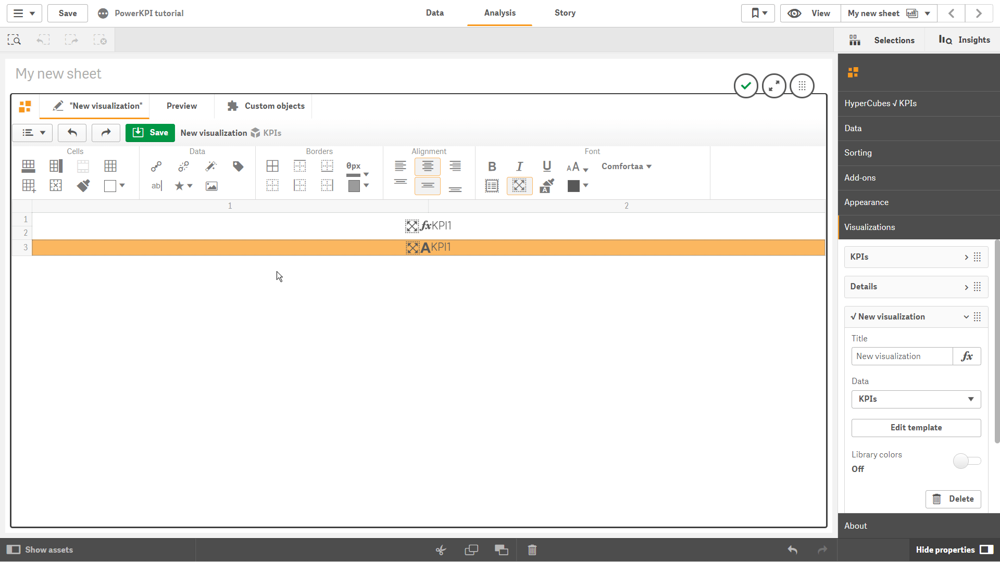

# Cells

“Cells” section of toolbar allows you to add/insert/remove rows, columns, merge/split cells, change background color and even copy styles settings between cells.


It has the following buttons:

*  - add row;
*  - add column;
*  - 
  merge several selected cells;
*  - 
  split merged cells;
*  - 
  insert row and/or column depending on current cells selections \(it will insert one row above the current selected one, or insert one column before the selected one, or insert one row and one column before the selected cell\);
*  
  - copy styles settings from the current selected cell and apply them on the cell which will be selected;
*  - 
  change background color on the selected cell/cells

To be able to merge cells, you should select cells from top left cell to bottom right cell holding left mouse button.


To apply some operations on several cells you should select them holding "Ctrl" key.

To select an entire column, you should click the column header \(cell with a column number\). In such a way, by clicking the row number, you can also select the entire row. It is possible to select several columns/rows by selecting corresponding column/row headers.

To quickly add copy of columns or rows select appropriate columns or rows and then click corresponding button  \(to add columns\) or  \(to add rows\).

