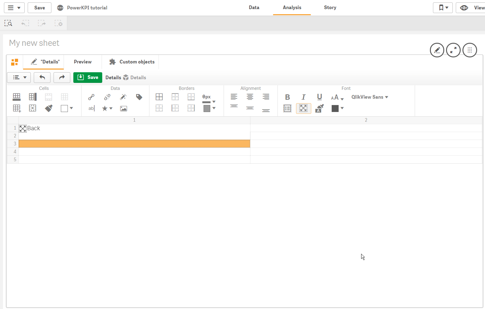
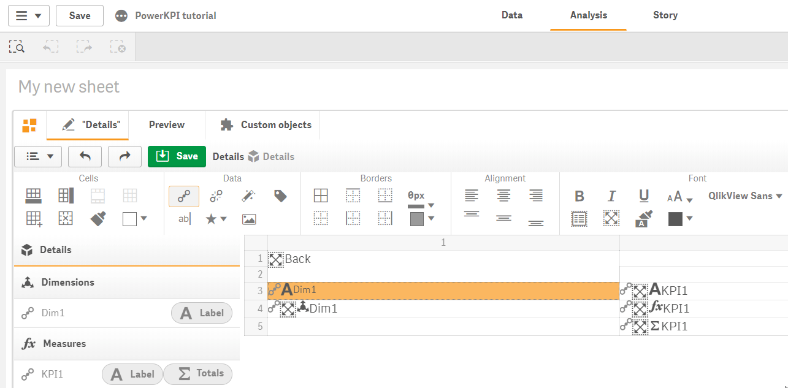
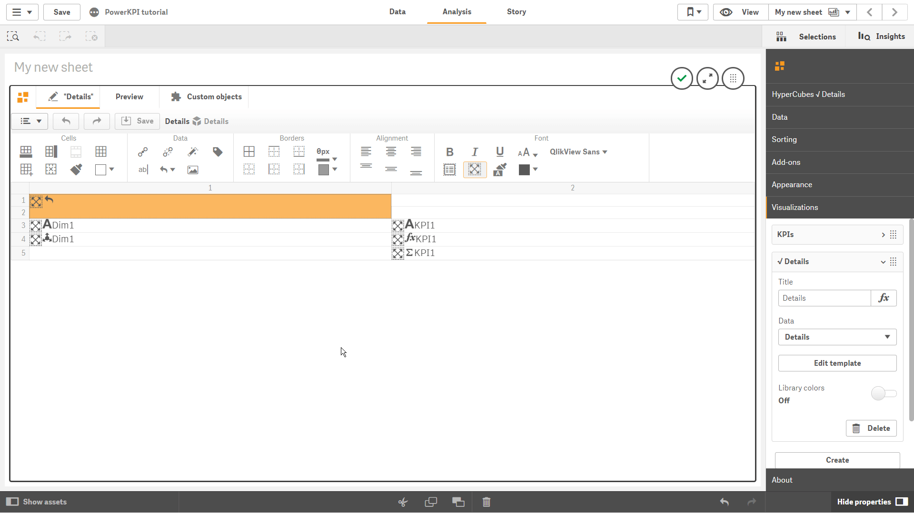
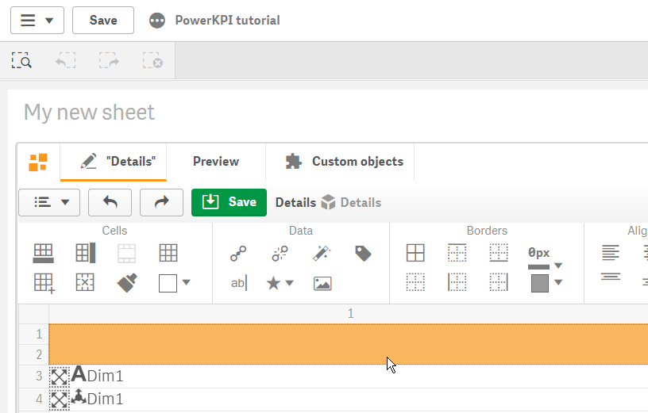
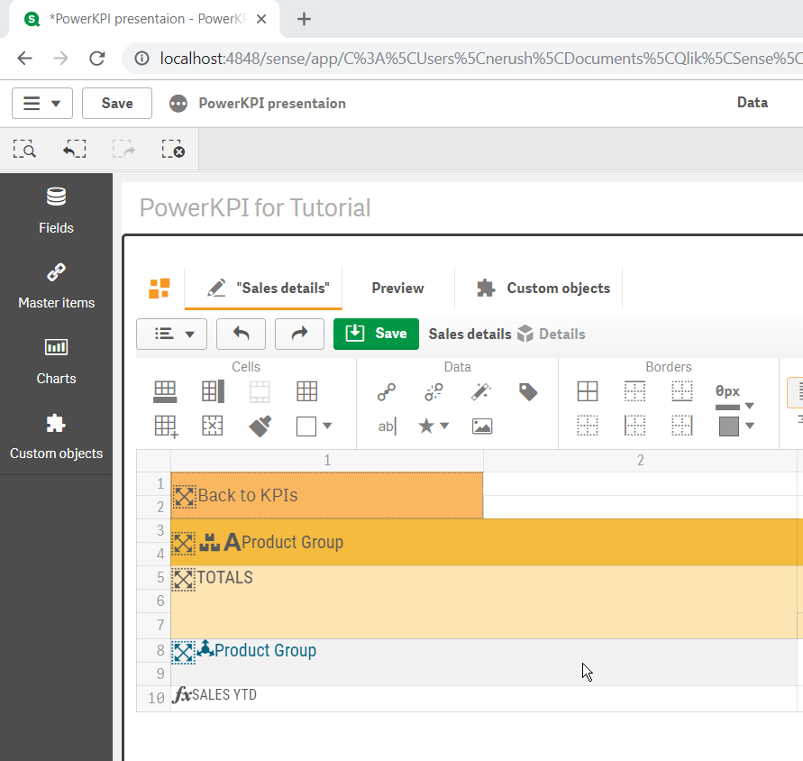
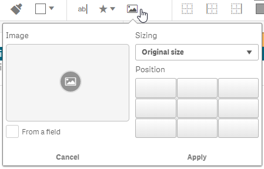
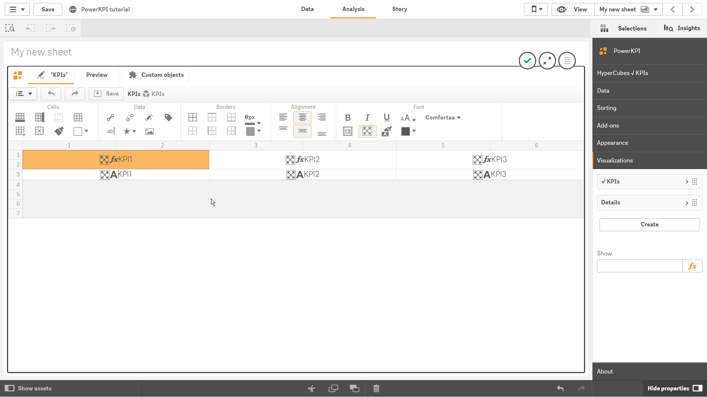

# Data

“Data” section of toolbar contains the following buttons:

* 
  - **open data panel** containing dimensions and measures which can be bonded to cell using simple drag-and-drop:

Data panel will show all dimensions \(if has been used\) and measures which have been added to Data section of the property panel.


Each dimension and measure contain “Label”  button, which will allow you to bind dimension/measure label within the template. Each measure, except the “Label” button, contains “Totals”    button. It allows you to bind total calculated for appropriate measure within the template. It makes sense to use “Totals” when constructing table-like templates. 

To bind a measure/dimension with the appropriate cell, select cell and click the appropriate measure/dimension. Or, if you prefer, drag data item \(dimension, measure, label or total\) onto template and drop it on the appropriate cell. In such a way you will bind your data assets to the designed template.

*   ****- **delete selected cell/cells binding** \(dimensions, measures, text, icons, images etc.\)

*  - 
  **open actions panel** which will allow you to apply actions on selected cell


See “Actions” section of the documentation for more details.


*  - 
  **open “Tags” panel** which will allow you to make markup of template to be able to build table-like views \(it makes sense to use only for table-like views with dimensions\)

For table-like templates you will have to select row numbers which correspond to details rows, and then to click on “Rows” tag .

In such a way you will always have to tag details rows for table-like templates:

If you need to change your markup, you can click on  icon to remove markup and to tag your rows in a different way.

*  
  - **insert any text into the selected cell**

* \*\*\*\* ****- **insert an icon into the selected cell**

It allows you to choose an icon, the position \(left or right from the content in a cell\), icon font and font size.

* - **insert an image** in the selected cell from a content library


See more about "Content libraries" in Qlik help

[https://help.qlik.com/en-US/sense/Subsystems/ManagementConsole/Content/Sense\_QMC/content-libraries-overview.htm](https://help.qlik.com/en-US/sense/Subsystems/ManagementConsole/Content/Sense_QMC/content-libraries-overview.htm)


Image  button will allow you to select an image from one of the predefined content library.

As another option, if the selected cell contains data binding \(dimension/field with a images links\), you might want to select “From a field” option.


“Sizing” parameter allows you to choose one of the predefined values to size image accordingly inside the selected cell.

 Using “Position” parameter, you might position an image in accordance with your requirements inside the selected cell.

