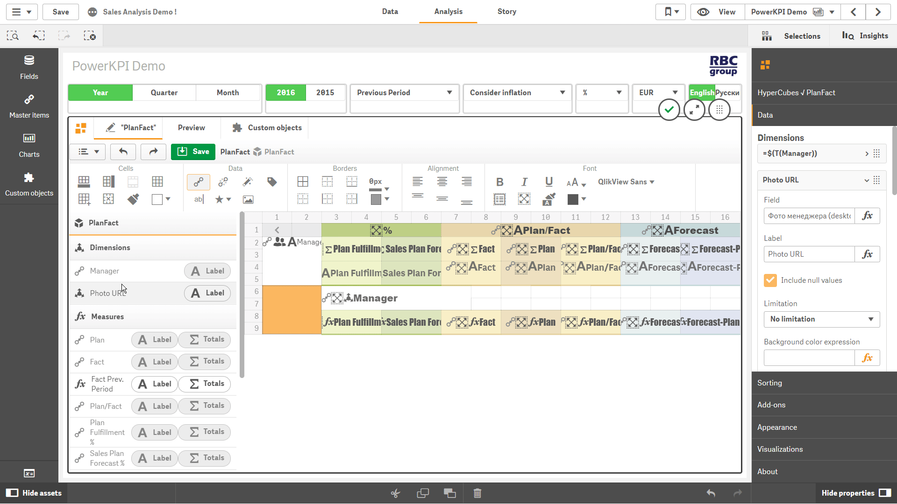

# Data

“Data” section of the toolbar contains the following buttons:


Dimensions / Measures


* 
  - **open data panel** contains dimensions and measures which can be bonded to cell using simple drag-and-drop:

Data panel will show all dimensions \(if any were used\) and measures which were added to Data section of the properties panel.

Each dimension and measure contain “Label”  button, which will allow you to bind dimension/measure label within the template. Each measure, except the “Label” button, contains “Totals”    button. It allows you to bind the total calculated for appropriate measure within the template. It makes sense to use “Totals” when constructing table-like templates. 

To bind a measure/dimension with the appropriate cell, select a cell and click the appropriate measure/dimension. Or, if you prefer, drag data item \(dimension, measure, label or total\) onto the template and drop it on the appropriate cell. In such a way you will bind your data assets to the designed template.


Delete


*   ****- **delete selected cell/cells binding** \(dimensions, measures, text, icons, images etc.\)


Actions


*  - 
  **open actions panel** allows you to apply actions on the selected cell


See “Actions” section of the documentation for more details.





Tags


*  - 
  **open “Tags” panel** allows you to make a markup of template to be able to build table-like views \(it makes sense to use only for table-like views with dimensions\)

For table-like templates you will have to select row numbers which correspond to the details rows, and then click on “Rows” tag .

In such a way you will always have to tag details rows for table-like templates:

If you need to change your markup, you can click on  icon to remove the markup and tag your rows in a different way.

\*\*\*\*


Text


*  
  - **insert any text into the selected cell**


Icons


* \*\*\*\* ****- **insert an icon into the selected cell**

It allows you to choose an icon, a position \(left, right or replace the content in a cell\), icon font and font size. 

In case of the "Replace" option it completely replaces the cell content. It makes sense to select such option on the cell with a linked measure. In such a way, icon will be displayed instead of the measure's value, but it will be possible, for example, to use the Value Color action that will change the icon color based on the measure's value. So, you will be able to get the result as it is shown on the image below, when the measure's values were replaced with the red or green "dot" icon.


See Demo Apps for more details





Images


* - **insert an image** in the selected cell from a content library


See "Content libraries" in Qlik help for more details

[https://help.qlik.com/en-US/sense/Subsystems/ManagementConsole/Content/Sense\_QMC/content-libraries-overview.htm](https://help.qlik.com/en-US/sense/Subsystems/ManagementConsole/Content/Sense_QMC/content-libraries-overview.htm)


Image  button will allow you to select an image from one of the predefined content libraries.

Alternatively, if the selected cell contains data binding \(dimension/field with images links\), you might want to select “From a field” option.

“Sizing” parameter allows you to choose one of the predefined values to size image accordingly inside the selected cell.

 Using “Position” parameter, you might position an image in accordance with your requirements inside the selected cell.

