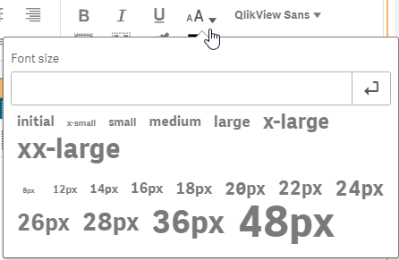
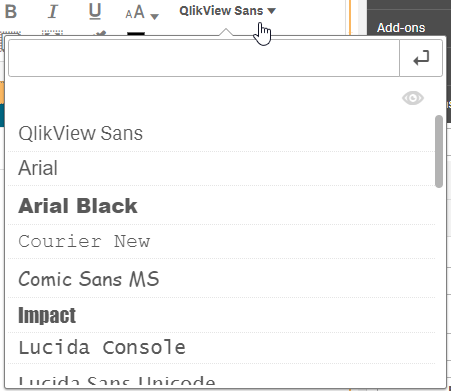
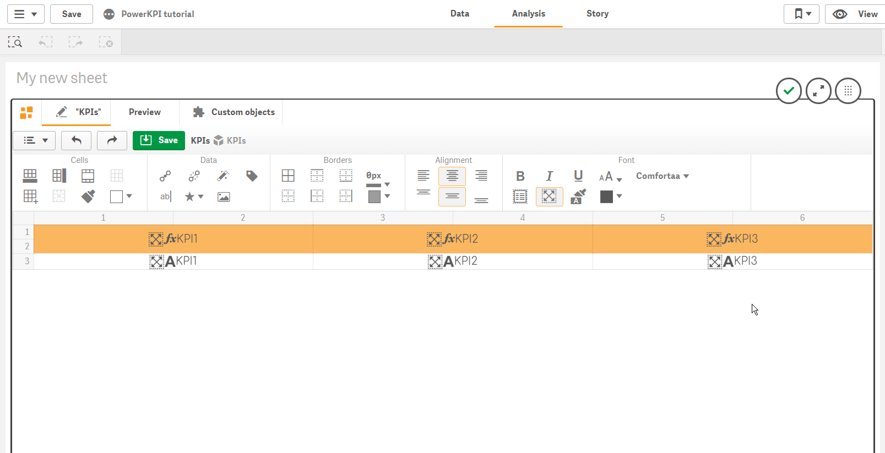

# Font

“Font” section of toolbar contains the following buttons:

*  - make text bold
*  - make text italic
*  - make text underlined
*  - select font size

It allows you to select or enter text size. There are several ways to specify the font size, including keywords or numerical values for pixels or ems.



See [https://developer.mozilla.org/en-US/docs/Web/CSS/font-size](https://developer.mozilla.org/en-US/docs/Web/CSS/font-size) for more details


*  - make text multiline
*  - make text responsive and, thus, text always will fit the cell size \(this option should be always used for responsive visualization templates\)


If you make text responsive and specify a font size at same time, it will be responsive but no more than specified size.


*  - clear applied font styles
*  - set font color
*  - select and apply font on selected cell/cells

Fonts with special icon  to the right from the font name specify that font comes as an external font included with PowerKPI component, and thus, it will be loaded and used automatically.

Fonts without  icon should be available on user computer. If the specified font isn’t be available on client side, the default web browser font will be used instead.

