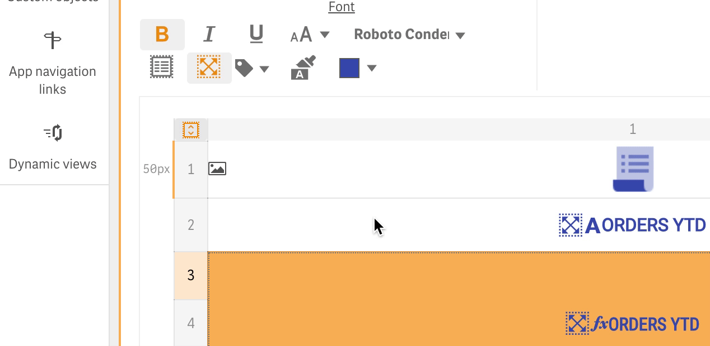
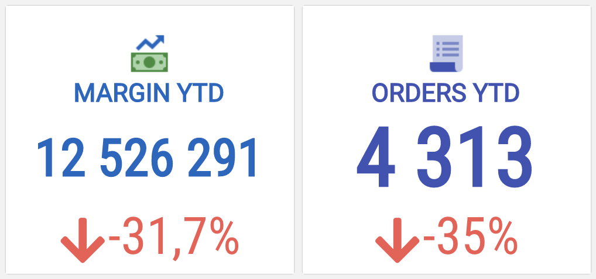

# Font

“Font” section of the toolbar contains the following buttons:

* .png>) - make text bold
* .png>) - make text italic
* .png>) - make text underlined
* .png>) - select font size

It allows you to select or enter the text size. There are several ways to specify the font size, including keywords or numerical values for pixels or ems.



See [https://developer.mozilla.org/en-US/docs/Web/CSS/font-size](https://developer.mozilla.org/en-US/docs/Web/CSS/font-size) for more details


* .png>) - make text multiline
* .png>) - make text responsive and, thus, the text will always fit the cell size (this option should always be used for responsive visualization templates)


If you make the text responsive and specify the font size at same time, it will be responsive but not more than the specified size.


*  - allows to set a font tag which defines global font size context. It will apply the same font size using same font in the PowerKPI objects if they have same size on a sheet as well as  the same cells size in the visualization templates. This button will be shown if the responsive option is set by using the .png>)toolbar button.

.png>)

* .png>) - clear applied font styles
* .png>) - set font color
* .png>) - select and apply font on the selected cell/cells

Fonts with special icon .png>) to the right from the font name specify that the font comes as an external font included with PowerKPI component, and thus, it will be loaded and used automatically.

Fonts without .png>) icon should be available (installed) on the user computer. If the specified font isn’t available on the client side, the default web browser font will be used instead.

