# What's new

### <mark style="color:green;">February 2023</mark>

### Object level actions&#x20;

Added support for object-level actions ("General" tab) in addition to cell-level actions ("Cells" tab). When the user clicks on a visualization, the object-level action fires first, followed by the cell-level actions.

<figure>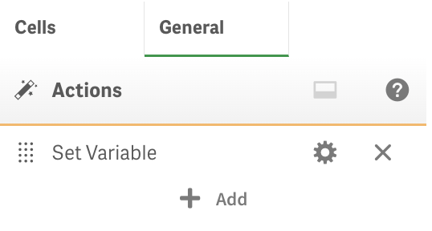<figcaption></figcaption></figure>

### **Show sidebar** action

<figure>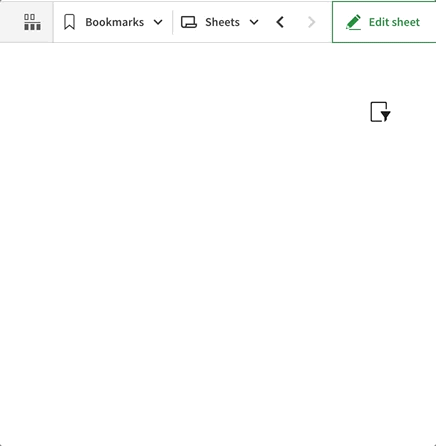<figcaption></figcaption></figure>

It supports HTML as well as embedding master visualizations by using the following syntax:

```
$object_id{css styles}
```

&#x20;**object\_id** - identifier of the master visualization object.&#x20;

**css styles** - the CSS styles to apply to the embedded object.

Example:

```
$9bc03224-f072-439f-b0de-3014860d4f8a{width:100%;height: 40px}
```

See more details [here](actions/show-sidebar.md).

<figure>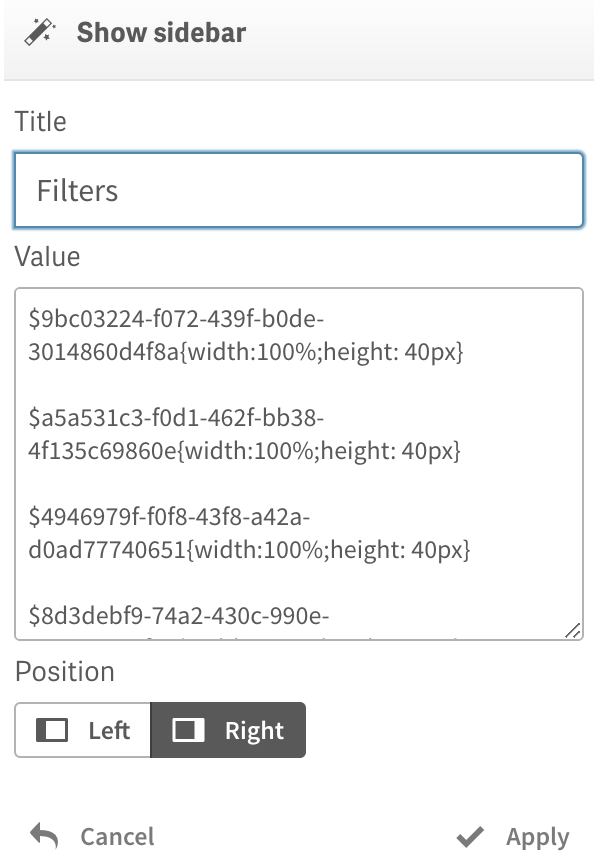<figcaption></figcaption></figure>

### **Show popover** action

It supports HTML as well as embedding master visualizations. See more details [here](actions/show-popover.md).

<figure><figcaption></figcaption></figure>

<figure><figcaption></figcaption></figure>

### **Tooltip** measure's attribute expression to simplify adding Tooltips&#x20;

<figure>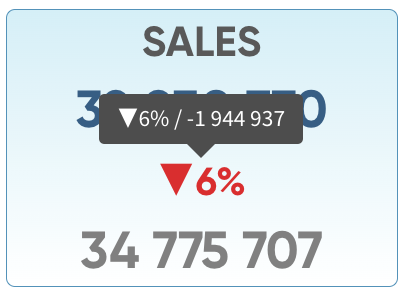<figcaption></figcaption></figure>

<figure>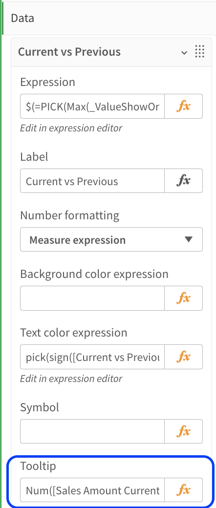<figcaption></figcaption></figure>

### "CSS classes" parameter to support custom themes

With custom themes developers can style Power KPI visualizations by applying custom classes defined in a theme.

```css
.qv-object-powerkpi .powerkpi-theme {
  background: linear-gradient(#f2f2f2, white) !important;
  border: solid 1px #f2f2f2;
  border-radius: 5px;
}

.qv-object-powerkpi .powerkpi-theme:hover  {
  background: linear-gradient(#CFF0F8, white) !important;
  border: solid 1px #3b93bd;
}
```

<figure>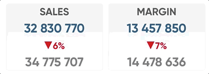<figcaption></figcaption></figure>

<figure>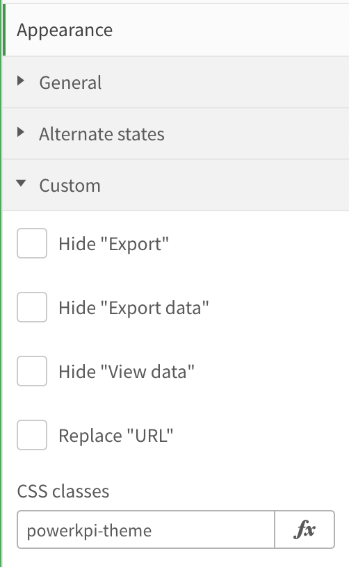<figcaption></figcaption></figure>

### Maximum font size in percentages for responsive text mode

It is now possible to set maximum font size in percentages when responsive text mode is activated for a cell using the  "Fit inside cell button" on the "Font" toolbar.  For example, in the image below, the maximum font size is set to 75% of the original size defined when drawing the data value for a particular cell in responsive mode.

<figure>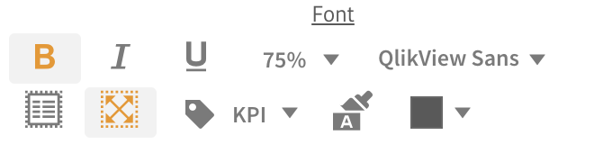<figcaption></figcaption></figure>

### <mark style="color:green;">August 2022</mark>

### **Chart Level Scripting support**&#x20;

It is a Qlik Sense feature available in **Qlik Cloud** and in **Qlik Sense Client Managed** version starting from **August 2022**.

Quote from Qlik documentation:

> **With chart level scripting, you can add script-like functionality to the results of a visualization. It complements chart expressions, as chart level scripting include control statements, such as loops and recursive actions, for more complex mathematical calculations. You can also modify multiple columns, as long as a placeholder exists in the chart, and add new rows to a result.**

**Chart level scripting must be enabled in the app** before you can add a chart script to a visualization.

See more at [help.qlik.com](https://help.qlik.com/en-US/cloud-services/Subsystems/Hub/Content/Sense\_Hub/ChartLevelScripting/chart-level-scripting.htm)

<figure>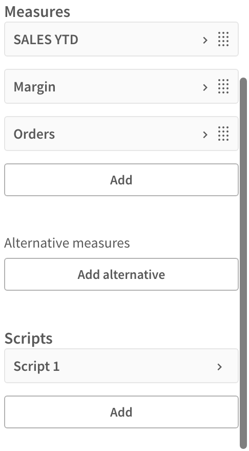<figcaption><p>Scripts section</p></figcaption></figure>

<figure>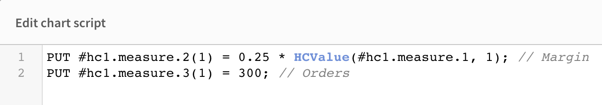<figcaption></figcaption></figure>

### <mark style="color:green;">September 2020</mark>

### Resizing of columns and rows

* **Resizing of columns and rows** has been added to be able to design more sophisticated visualization templates.

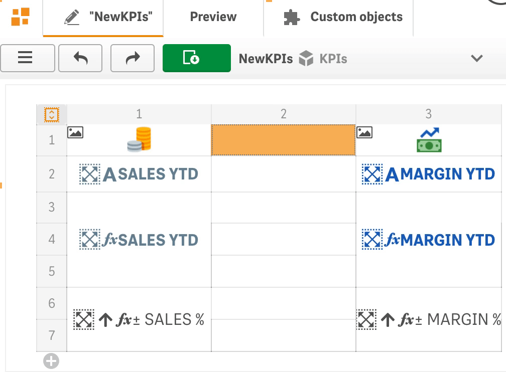

It is also possible to change width/height of a column/row using the resize dialog by clicking on a column/row resize icon.

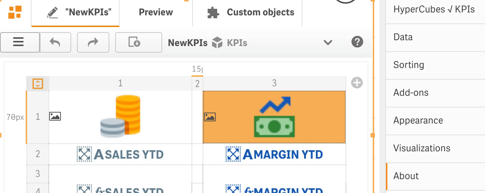

### Embedding images using base64 encoding

* It is easy to **embed images** in visualizations **in base64 encoding** now.


### **Embedding master visualizations**

* **Embedding master visualizations** can be done with toolbar button or context menu for a selected cell, which also allows to **change the interactions and selections options** for the master object, or **delete** the **embedded master object**.


### **Insert and delete operations**

* **Insert and delete operations** have been **improved** and it is now possible to insert or delete columns or rows even if there are cells which span across several columns or rows.

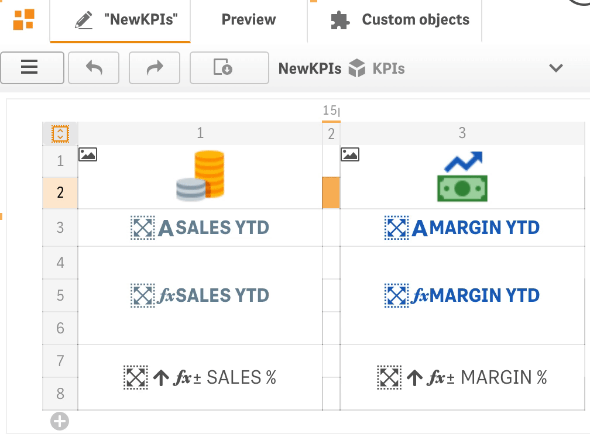

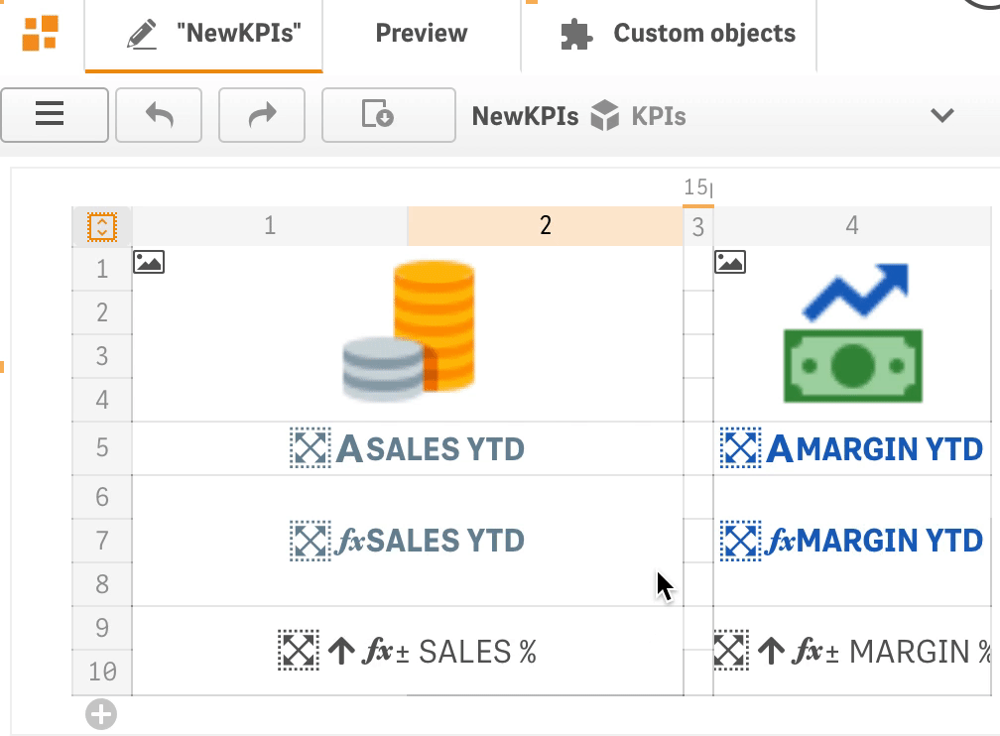

### Font tags

* **Font tags** allow to apply the **same font size** on various PowerKPI objects if they have same size on a sheet.

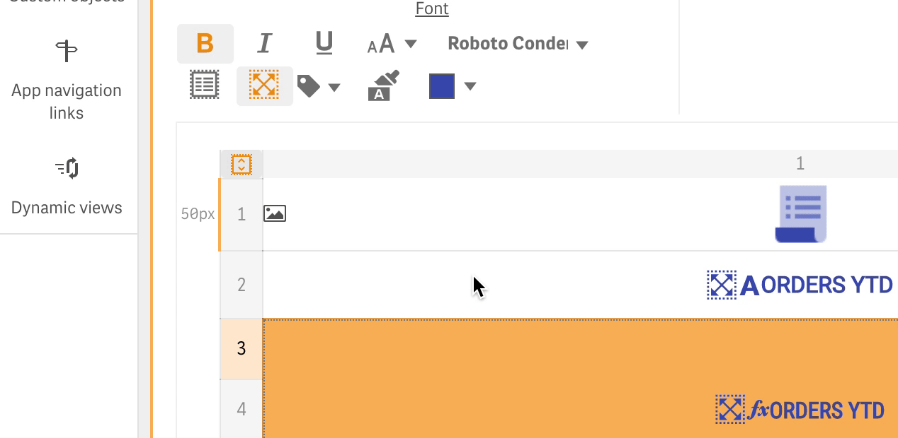

.png>)

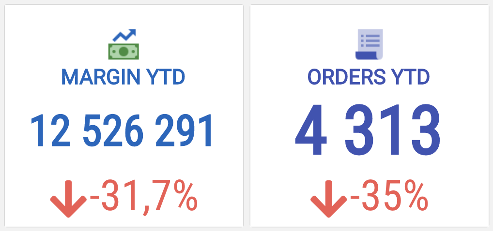

### Apply symbol action

* **Apply symbol action** has been **extended** with the possibility to map "Symbol" expression values to icons.

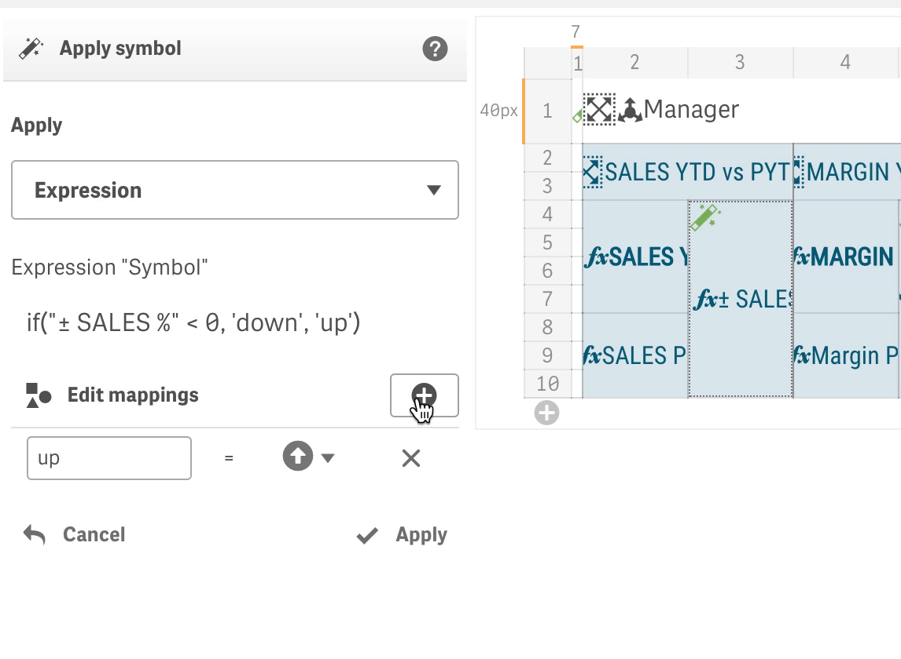

* and other small improvements:
  * the Value color action has been extended with the "Text color expression" option.&#x20;
  * Shift + click on a color picker apply a color without opening the color dialog.

### <mark style="color:green;">April, June 2020</mark>

### Trusted Extension Developer program accreditation

* **Qlik Sense June 2020 accreditation on Trusted Extension Developer program.**

### Qlik Cloud Services and Qlik Sense Enterprise on Kubernetes support

* **Qlik Cloud Services (Business and Enterprise)** and **Qlik Sense Enterprise on Kubernetes support.** See installation instructions [here](https://help.rbcgrp.com/installation#how-to-install-extension-on-qlik-cloud-services-business-and-enterprise).

### Preview in Edit mode

* **Preview in the Qlik Sense Edit mode** works now in the same way as component visualize data in the Analysis mode.  To open up the PowerKPI editor a developer should click on a button  in the top left corner of the component or, as another option, open Visualizations sections on the property panel and then expand an appropriate  visualization and click on the "Edit template" button. The editor will be loaded and shown instead of a visualization.

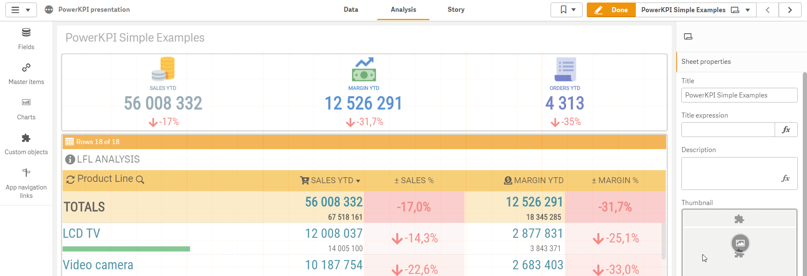

### Editor Context Menu

* **Editor context menu** has been added to increase a developer productivity. Toolbar panel can be collapsed and expanded now.

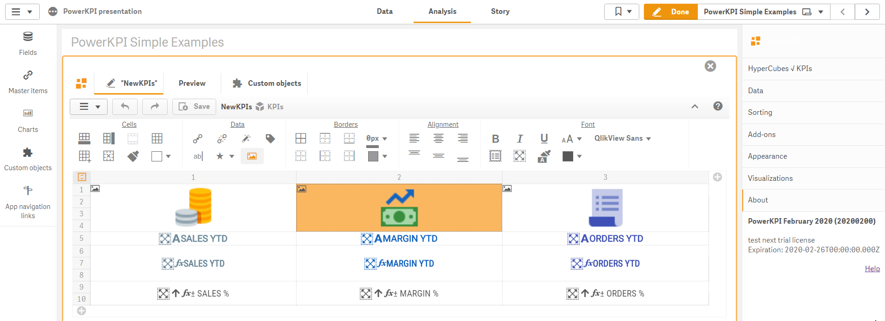

### Productivity enhancements

* The ability to create a visualization template in a couple of clicks has been added. The "Dimensions/Measures" panel automatically opens up when new visualization created. "Apply all" button allows developers to apply and use all dimensions and measures configured on the data sections of the property panel. It also applies predefined set of actions like "Sort", "Alternative dimensions/measures", "Searchable dimension", "Select dimension value", etc.

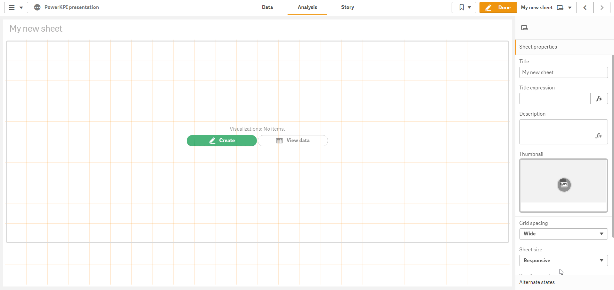

### Add rows and columns buttons

* **Quick add rows/columns buttons**

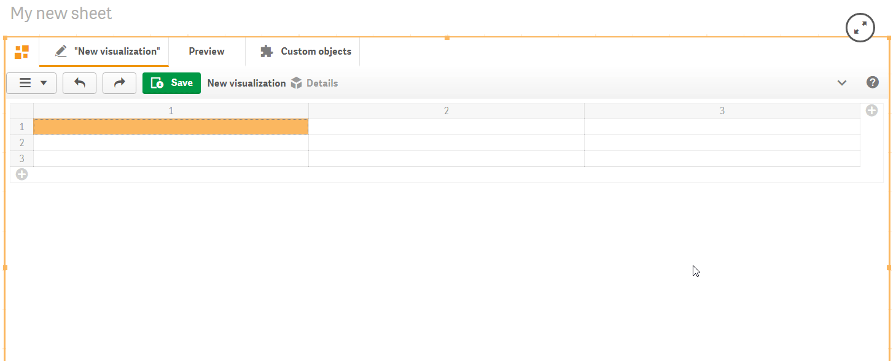

### Native and Virtual scrolling modes

* **Native and Virtual scrolling modes for tables.** Native mode uses native pageable scroll in which the  "Load more" or "Load previous" buttons can be used to load the next or previous page of the data, while virtual scrolling mode allows to scroll the entire dataset.

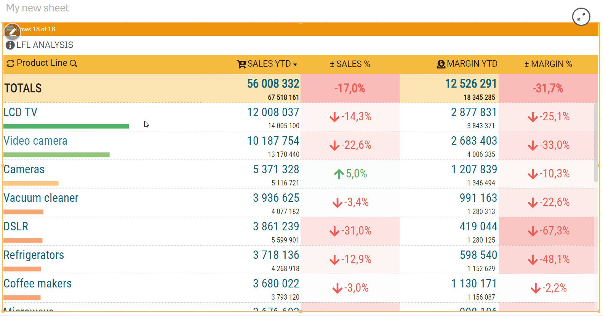

### Fit height button

* **"Fit height" quick button.** It allows to set mode  in which it will shrink or stretch a visualization to fit the occupied by the component area.

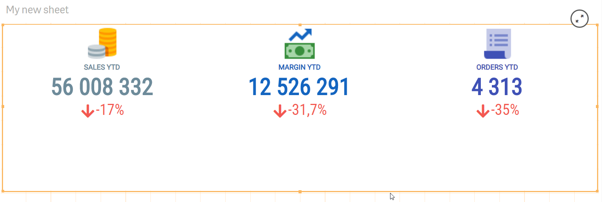

### Dimensions and Measures popup menu

* Double click on a cell or use **Ctrl + Space** (**⌘ + Space**)  to open up the dimensions and measures popup menu.

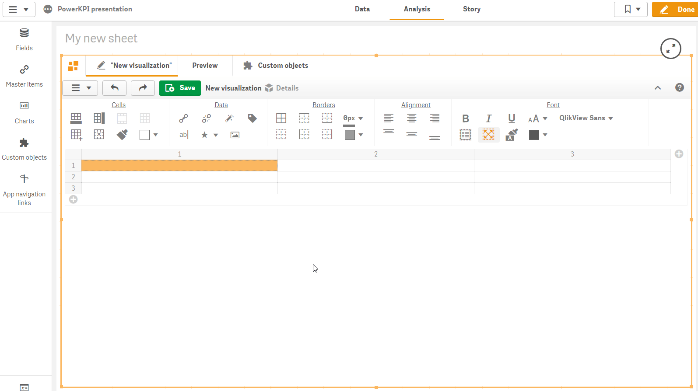

### Apply styles action

* **Apply styles action** allows to conditionally apply styles on a cell. See the action description [here](actions/apply-styles.md).

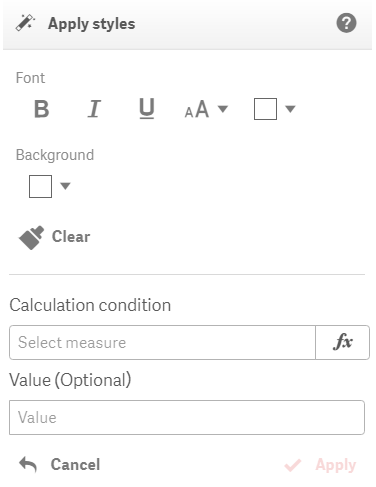

### Apply symbol action

* **Apply symbol action** allows conditionally add an icon to a measure. See the action description [here](actions/apply-symbol.md).

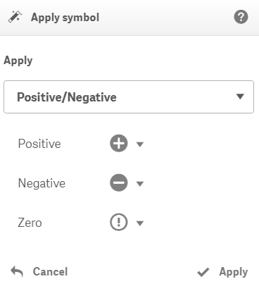

### Editor keyboard shortcuts

* **Editor keyboard shortcuts** enhancements

Keyboard **arrows keys** allow to navigate between cells;&#x20;

Hold **Shift** and use **arrows** to select cells;

**Ctrl + Alt + P** (**⌘ + Alt + P**) - preview mode;

**Ctrl + Alt + E** (**⌘ + Alt + E**) - edit mode (for selected component);

**Ctrl + Alt + C** (**⌘ + Alt + C**) - copy a cell content (including styling options and actions);

**Ctrl + Alt + V** (**⌘ + Alt + V**) - paste copied cell content;

**Ctrl + Space** (**⌘ + Space**) - open up the dimensions and measures popup menu.

See full editor keyboard shortcuts list [here](visual-editor/visual-editor-keyboard-shortcuts.md).

* **and other performance improvements and bug fixes**.

