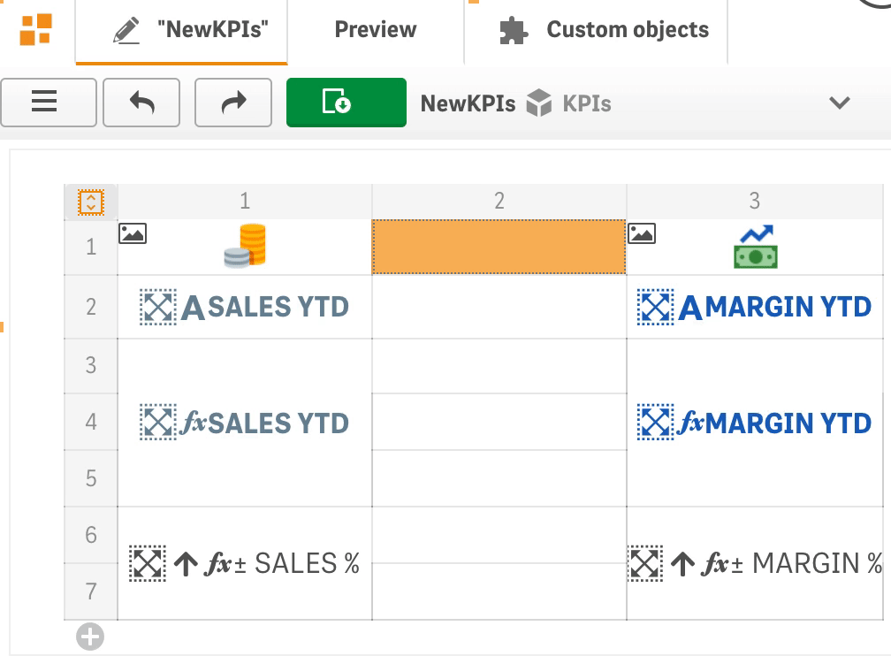
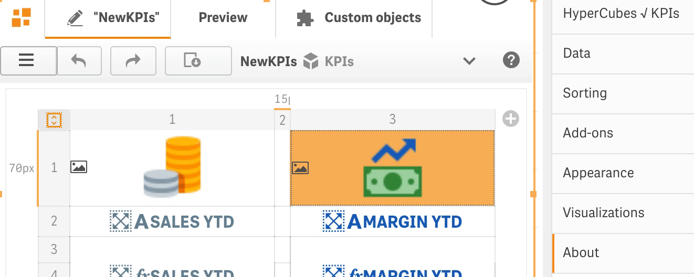
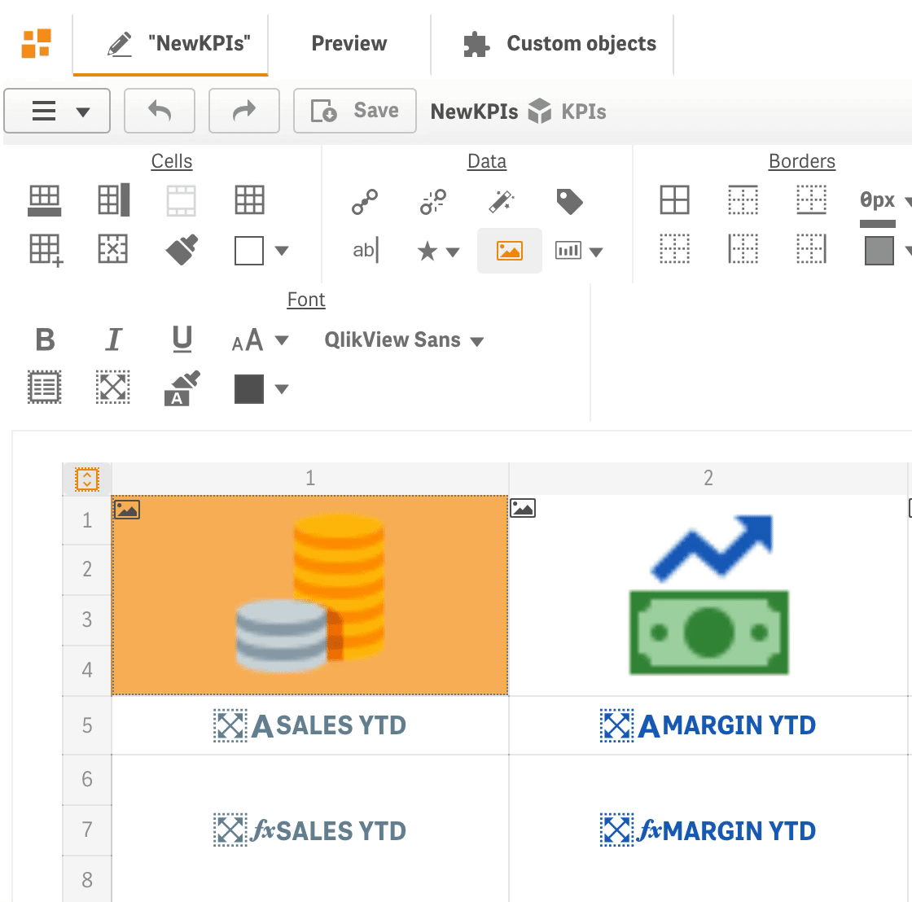
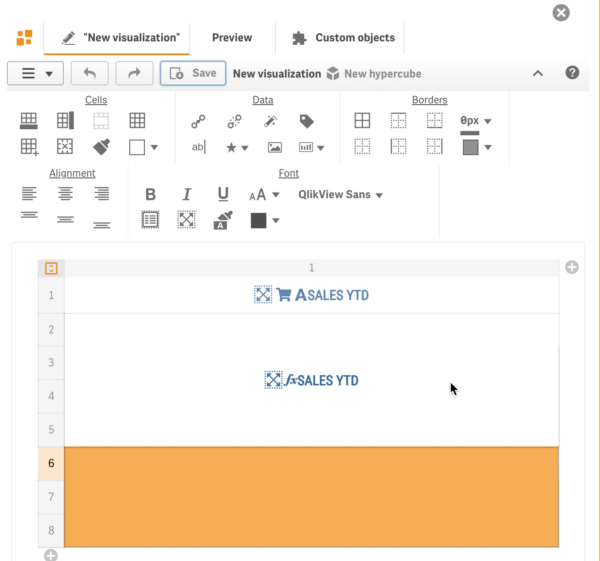
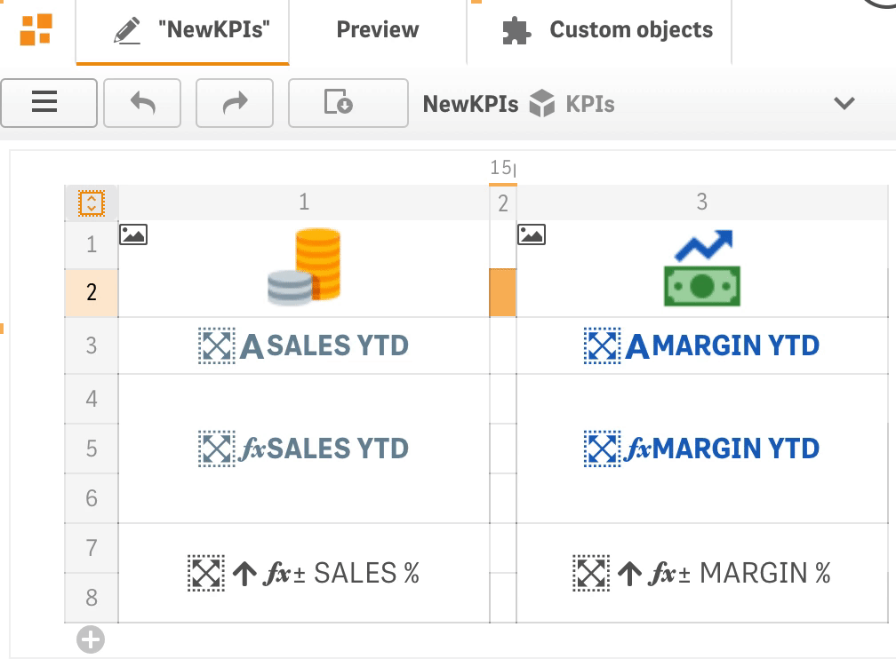
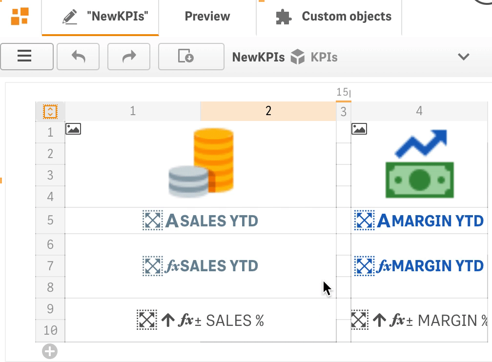
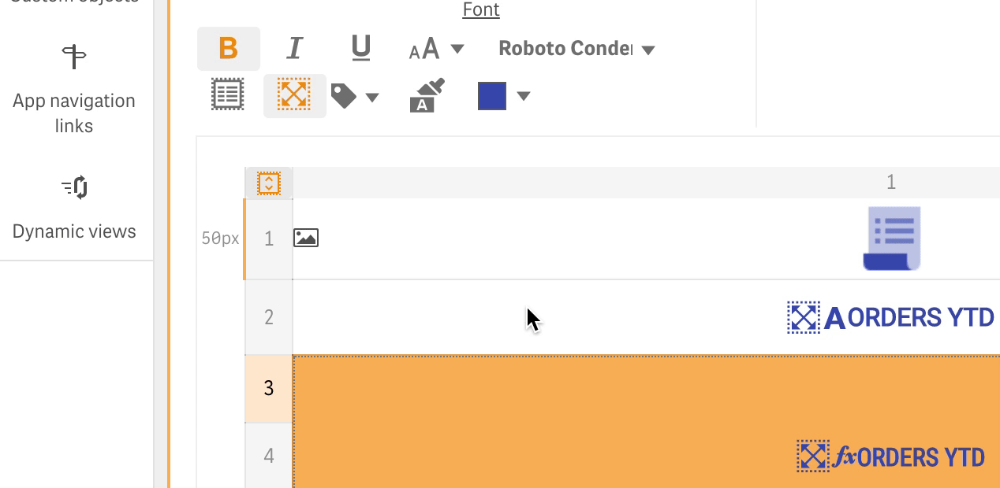
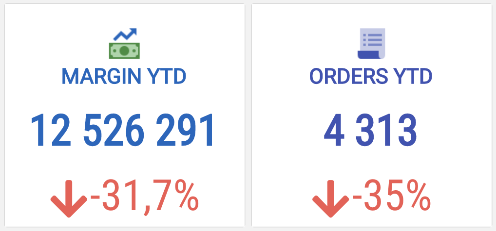
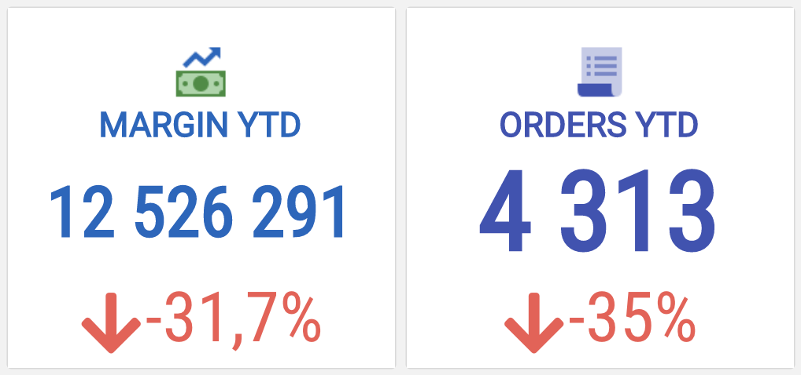
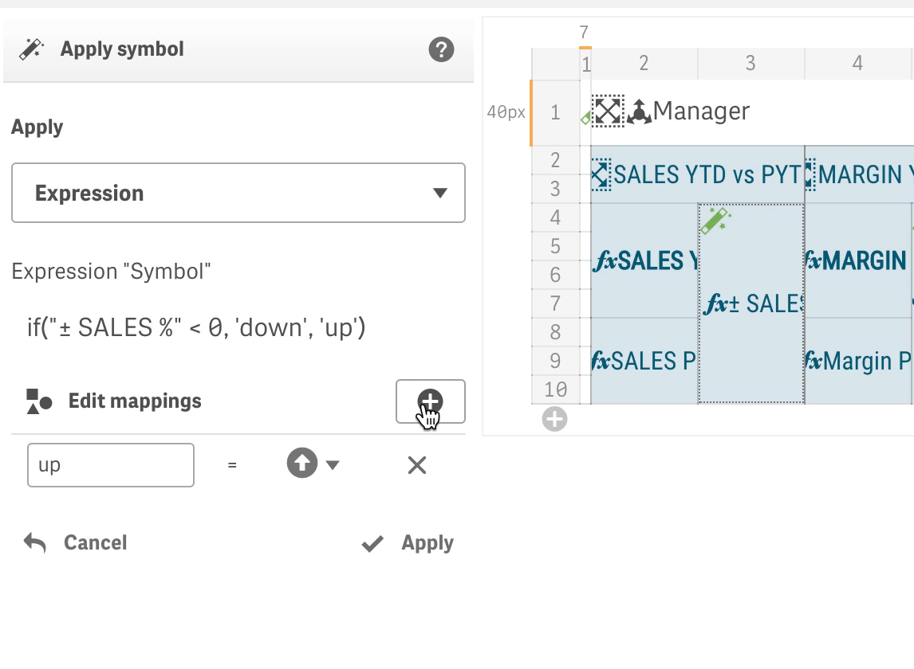

# What's new

### September 2020

* **Resizing of columns and rows** has been added to be able to design more sophisticated visualization templates.

It is also possible to change width/height of a column/row with the help of the resize dialog by clicking on a column/row resize icon.

* It is an easy to **embed images** in visualizations **in base64 encoding** now.

* **Embedding master visualizations** can be done by using a toolbar button or by using the context menu for a selected cell, which also allows to **change the interactions and selections options** for the master object, or **delete** the **embedded master object**.

* **Inserts and deletes operations** have been **improved** and it is now possible to inserts or deletes columns or rows even if there are cells that span across several columns or rows.

* **Font tags** allows to apply the **same font size** on various PowerKPI objects if they have same size on a sheet.

* **Apply symbol action** has been **extended** with the possibility to map "Symbol" expression values to icons.

* and other small improvements:
  * the Value color action has been extended with the "Text color expression" option. 
  * Shift + click on a color picker apply a color without opening the color dialog.

### April, June 2020

* **Qlik Sense June 2020 accreditation on Trusted Extension Developer program.**
* **Qlik Cloud Services \(Business and Enterprise\)** and **Qlik Sense Enterprise on Kubernetes support.** See installation instructions [here](https://help.rbcgrp.com/installation#how-to-install-extension-on-qlik-cloud-services-business-and-enterprise).
* **Preview in the Qlik Sense Edit mode** works now in the same way as component visualize data in the Analysis mode.  To open up the PowerKPI editor a developer should click on a button  in the top left corner of the component or, as another option, open Visualizations sections on the property panel and then expand an appropriate  visualization and click on the "Edit template" button. The editor will be loaded and shown instead of a visualization.

* **Editor context menu** has been added to increase a developer productivity. Toolbar panel can be collapsed and expanded now.

* **Developers productivity enhancements** - ability to create a visualization template in couple of clicks. The "Dimensions/Measures" panel automatically opens up when new visualization created. "Apply all" button allows developers to apply and use all dimensions and measures configured on the data sections of the property panel. It also applies predefined set of actions like "Sort", "Alternative dimensions/measures", "Searchable dimension", "Select dimension value", etc.

* **Quick add rows/columns buttons**

* **Native or Virtual scrolling mode for tables.** Native mode uses native pageable scroll in which the  "Load more" or "Load previous" buttons can be used to load the next or previous page of the data, while virtual scrolling mode allows to scroll the entire dataset.

* **"Fit height" quick button.** It allows to set mode  in which it will shrink or stretch a visualization to fit the occupied by the component area.

* **Dimensions and measures popup menu.** Double click on a cell or use **Ctrl + Space** \(**⌘ + Space**\)  to open up the dimensions and measures popup menu.

* **Apply styles action** allows to conditionally apply styles on a cell. See the action description [here](actions/apply-styles.md).

* **Apply symbol action** allows conditionally add an icon to a measure. See the action description [here](actions/apply-symbol.md).

* **Editor keyboard shortcuts** enhancements

Keyboard **arrows keys** allow to navigate between cells; 

Hold **Shift** and use **arrows** to select cells;

**Ctrl + Alt + P** \(**⌘ + Alt + P**\) - preview mode;

**Ctrl + Alt + E** \(**⌘ + Alt + E**\) - edit mode \(for selected component\);

**Ctrl + Alt + C** \(**⌘ + Alt + C**\) - copy a cell content \(including styling options and actions\);

**Ctrl + Alt + V** \(**⌘ + Alt + V**\) - paste copied cell content;

**Ctrl + Space** \(**⌘ + Space**\) - opens up the dimensions and measures popup menu.

See full editor keyboard shortcuts list [here](visual-editor/visual-editor-keyboard-shortcuts.md).

* **and other performance improvements and bug fixes**.

