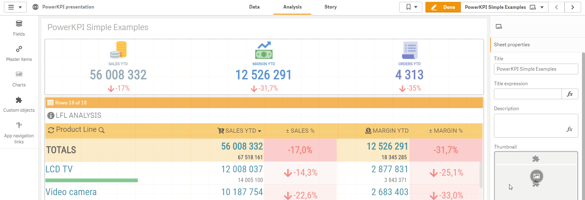
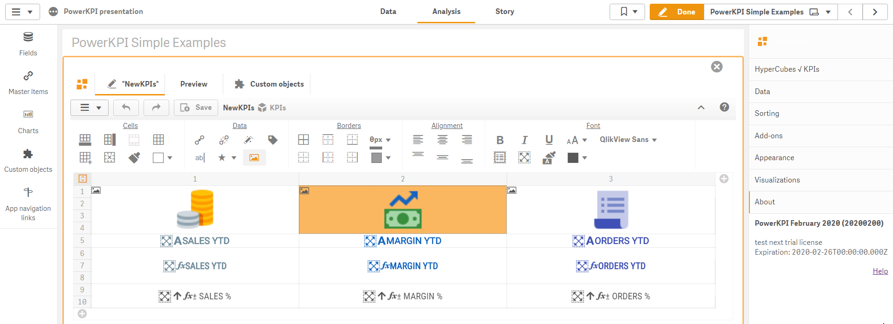
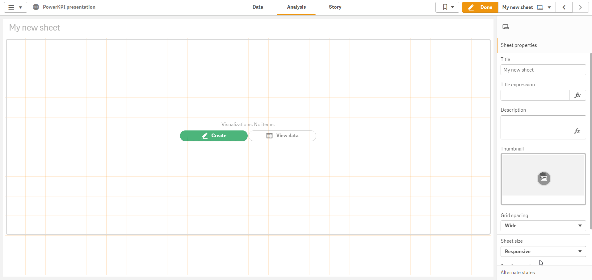
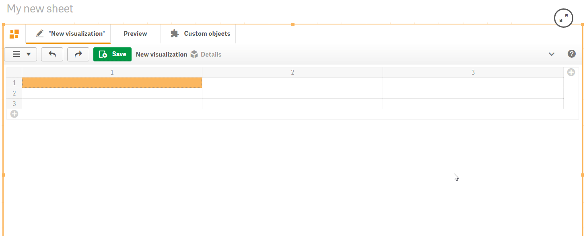
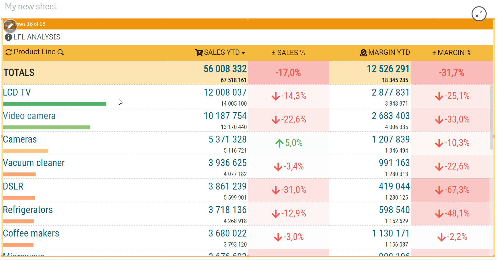
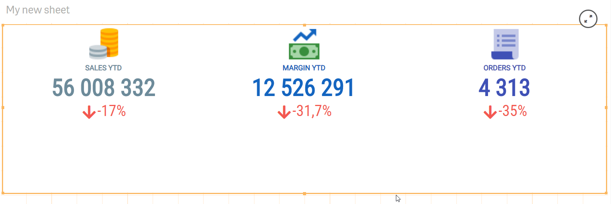
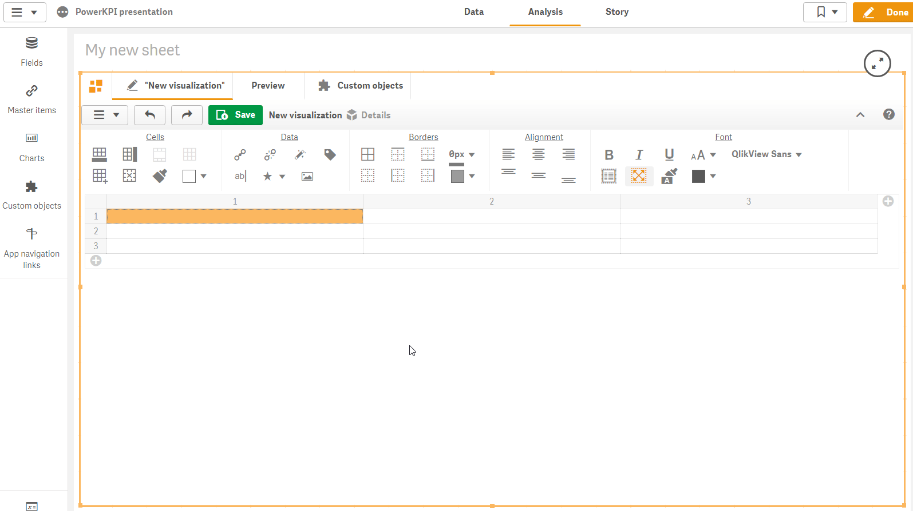
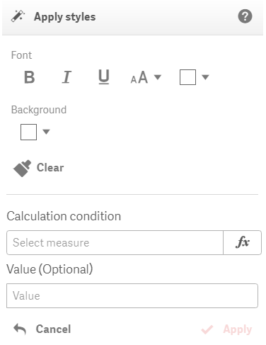
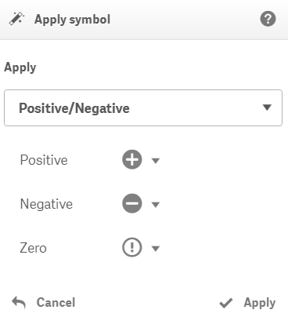

# What's new

### February 2020

* **Preview in the Qlik Sense Edit mode** works now in the same way as component visualize data in the Analysis mode.  To open PowerKPI editor a developer should click on a button  in the top left corner or, as another option, open Visualizations sections on the property panel and then expand an appropriate  visualization and click on the "Edit template" button. The editor will be loaded and shown instead of a visualization.

* **Editor context menu** has been added to increase a developer productivity. Toolbar panel can be collapsed and expanded now.

* **Developers productivity enhancements** - ability to create visualization template in couple of clicks. The "Dimensions/Measures" panel automatically opens up when new visualization created. "Apply all" button allows developers to apply and use all dimensions and measures configured on the data sections of the property panel. It also applies predefined set of actions like "Sort", "Alternative dimensions/measures", "Searchable dimension", "Select dimension value", etc.

* **Quick add rows/columns buttons**

* **Native or Virtual scrolling mode for tables.** Native mode uses native pageable scroll in which the  "Load more" or "Load previous" buttons can be used to load the next or previous page of the data, while virtual scrolling mode allows to scroll entire dataset.

* **"Fit height" quick button.** It allows to set mode  in which it will shrink or stretch visualization to fit the occupied by the component area.

* **Dimensions and measures popup menu.** Double click on a cell or use **Ctrl + Space** \(**⌘ + Space**\)  to open dimensions and measures popup menu.

* **Apply styles action** allows to conditionally apply styles on a cell.

* **Apply symbol action** allows conditionally add an icon to a measure

* **Editor keyboard shortcuts** enhancements

Keyboard **arrows** allow to navigate between cells; 

Hold **Shift** and use **arrows** to select cells;

**Ctrl + Alt + P** \(**⌘ + Alt + P**\) - preview mode;

**Ctrl + Alt + E** \(**⌘ + Alt + E**\) - edit mode \(for selected component\);

**Ctrl + Alt + C** \(**⌘ + Alt + C**\) - copy cell content \(including styling options and actions\);

**Ctrl + Alt + V** \(**⌘ + Alt + V**\) - paste copied cell content;

**Ctrl + Space** \(**⌘ + Space**\) - opens dimensions and measures popup menu.

* **and other performance improvements and bug fixes**.

